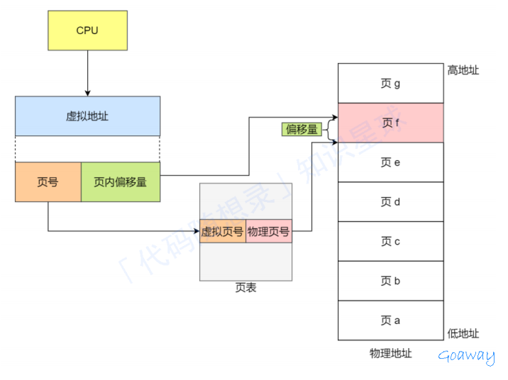
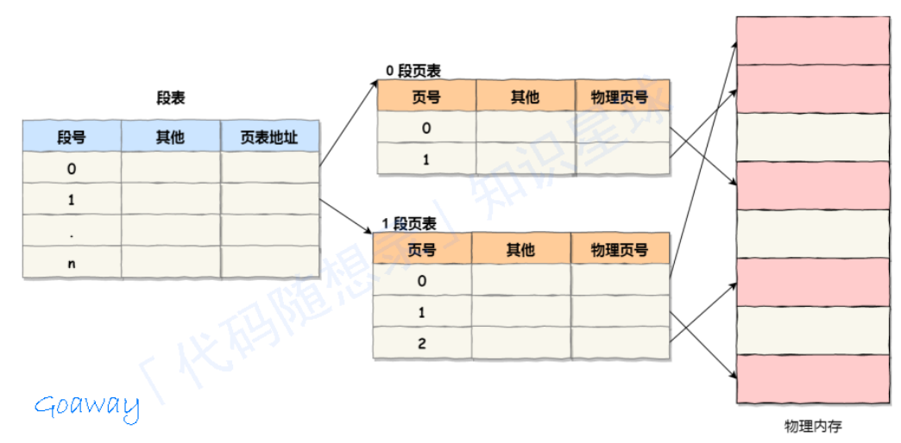
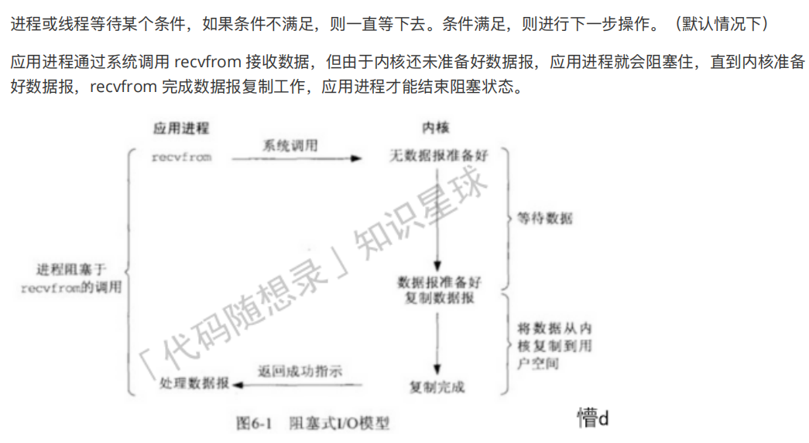
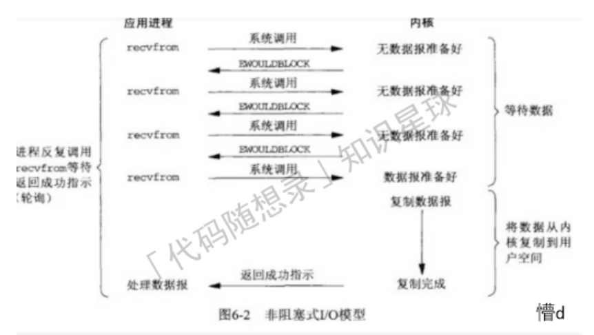
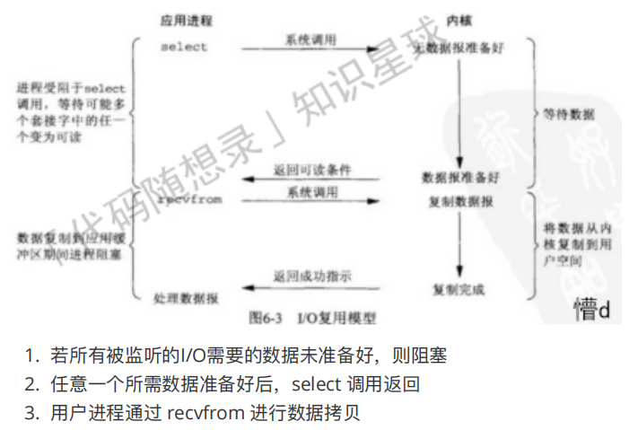
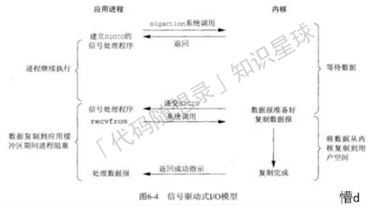
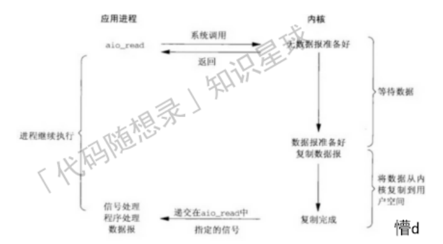
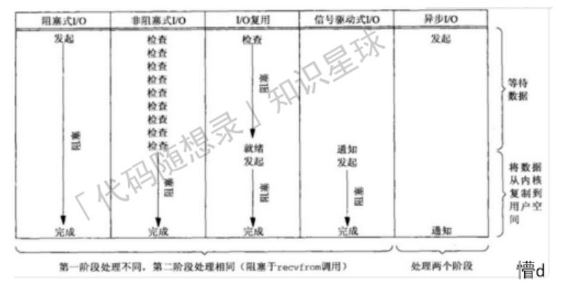

# Linux

## 什么是IO多路复⽤

I/O多路复⽤是⼀种在单个线程或进程中处理多个输⼊和输出操作的机制。它允许单个进程同时监视多个⽂件描述符(通常是套接字)，当⼀个或多个⽂件描述符准备好读或写时，它就可以⽴即响应。
I/O多路复⽤通常通过select、poll、epoll等系统调⽤来实现。

- select： select是⼀个最古⽼的I/O多路复⽤机制，它可以监视多个⽂件描述符的可读、可写和错误状态。然⽽，但是它的效率可能随着监视的⽂件描述符数量的增加⽽降低。
- poll： poll是select的⼀种改进，它使⽤轮询⽅式来检查多个⽂件描述符的状态，避免了select中⽂件描述符数量有限的问题。但对于⼤量的⽂件描述符，poll的性能也可能变得不⾜够⾼效。
- epoll： epoll是Linux特有的I/O多路复⽤机制，相较于select和poll，它在处理⼤量⽂件描述符时更加⾼效。
- epoll使⽤事件通知的⽅式，只有在⽂件描述符就绪时才会通知应⽤程序，⽽不需要应⽤程序轮询。

I/O多路复⽤允许在⼀个线程中处理多个I/O操作，避免了创建多个线程或进程的开销，允许在⼀个线程中处理多个I/O操作，避免了创建多个线程或进程的开销。

## select/poll/epoll的区别和联系

select , poll 和 epoll 都是I/O多路复⽤技术，它们⽤于同时处理多个I/O操作，特别是在⾼并发⽹络编程中。

### select

select 是最早的I/O多路复⽤技术，它可以同时监视多个⽂件描述符（file descriptor, FD）的I/O状态（如可读、可写、异常等）。 select 函数使⽤⼀个⽂件描述符集合（通常是⼀个位图）来表示要监视的⽂件描述符，当有I/O事件发⽣时，select 会返回对应的⽂件描述符集合。

select的主要限制如下：

- ⽂件描述符数量限制： select 使⽤⼀个位图来表示⽂件描述符集合，这限制了它能够处理的⽂件描述符数量（通常是1024个）。
- 效率问题：当⽂件描述符数量较⼤时， select 需要遍历整个⽂件描述符集合来查找就绪的⽂件描述符，这会导致较低的效率。
- ⾮实时性：每次调⽤ select 时，需要重新设置⽂件描述符集合，这会增加函数调⽤的开销。

### poll

poll 是为了克服 select 的限制⽽引⼊的⼀种I/O多路复⽤技术。 poll 使⽤⼀个⽂件描述符数组（通常是⼀个结构体数组）来表示要监视的⽂件描述符。与 select 类似， poll 可以监视多个⽂件描述符的I/O状态。

oll的优点如下：

- ⽂件描述符数量不受限制：由于 poll 使⽤⼀个动态数组来表示⽂件描述符，因此它可以处理任意数量的⽂件描述符。
- 效率相对较⾼： poll 在查找就绪的⽂件描述符时，只需要遍历实际使⽤的⽂件描述符数组，⽽不是整个⽂件描述符集合。

然⽽， poll 仍然存在⼀些问题：

- 效率问题：尽管 poll 相对于 select 具有较⾼的效率，但当⽂件描述符数量很⼤时，它仍然需要遍历整个⽂件描述符数组。
- ⾮实时性：与 select 类似，每次调⽤ poll 时，需要重新设置⽂件描述符数组。

### epoll

epoll 是Linux特有的⼀种⾼效I/O多路复⽤技术，它克服了 select 和 poll 的主要限制。 epoll 使⽤⼀个事件驱动（event-driven）的⽅式来处理I/O操作，它只会返回就绪的⽂件描述符，⽽不是遍历整个⽂件描述符集合。

epoll的主要优点如下：

- ⾼效： epoll 使⽤事件驱动的⽅式来处理I/O操作，因此它在处理⼤量⽂件描述符时具有很⾼的效率。当有I/O事件发⽣时， epoll 可以⽴即得到通知，⽽⽆需遍历整个⽂件描述符集合。这使得 epoll 在⾼并发场景中具有更好的性能。
- 可扩展性：与 poll 类似， epoll 可以处理任意数量的⽂件描述符，因为它使⽤⼀个动态数据结构来表示⽂件描述符。
- 实时性： epoll 使⽤⼀个内核事件表来记录要监视的⽂件描述符和事件，因此在每次调⽤ epoll 时⽆需重新设置⽂件描述符集合。这可以减少函数调⽤的开销，并提⾼实时性。

`epoll`具有诸多优点，但它⽬前仅在Linux平台上可⽤。对于其他平台，可能需要使⽤类似的I/O多路复⽤技术，如BSD中的`kqueue`。

总结： select 是最早的I/O多路复⽤技术，但受到⽂件描述符数量和效率⽅⾯的限制。 poll 克服了⽂件描述符数量的限制，但仍然存在⼀定的效率问题。 epoll 是⼀种⾼效的I/O多路复⽤技术，尤其适⽤于⾼并发场景，但它仅在Linux平台上可⽤。⼀般来说，epoll的效率是要⽐select和poll⾼的，但是对于活动连接较多的时候，由于回调函数触发的很频繁，其效率不⼀定⽐select和poll⾼。所以epoll在连接数量很多，但活动连接较⼩的情况性能体现的⽐较明显。

## Linux 内存管理

1. 程序⽂件段
包括程序的⼆进制可执⾏代码，只读；TEXT

2. 已初始化数据段
包括已初始化的全局变量和静态常量；DATA

3. 未初始化数据段
包括未初始化的静态变量和全局变量；BSS

4. 堆段
包括动态分配的内存，从低地址开始向上增⻓；

5. ⽂件映射段
包括动态库、共享内存等，从低地址开始向上增⻓（跟硬件和内核版本有关）；

6. 栈段
包括函数的参数值和局部变量、函数调⽤的上下⽂等。栈的⼤⼩是固定的，⼀般是 8 MB 。当然系统也提供了参数，以便我们⾃定义⼤⼩；栈区是从⾼地址位向低地址位增⻓的

## Linux虚拟内存

对32位处理器，虚拟内存空间为4G，每个进程都认为⾃⼰拥有4G的空间，实际上，在虚拟内存对应的物理内存上，可能只对应的⼀点点的物理内存。

进程得到的这4G虚拟内存是⼀个连续的地址空间（这也只是进程认为），⽽实际上，它通常是被分隔成多个物理内存碎⽚，还有⼀部分存储在外部磁盘存储器上，在需要时进⾏数据交换。

由于存在两个内存地址，因此⼀个应⽤程序从编写到被执⾏，需要`进⾏两次映射`。第⼀次是`映射到虚拟内存空间`，第⼆次时`映射到物理内存空间`。在计算机系统中，第两次映射的⼯作是由硬件和软件共同来完成的。承担这个任务的`硬件部分叫做存储管理单元 MMU`，`软件部分`就是操作系统的`内存管理模块`了。

### 如何处理虚拟地址和物理地址的关系--内存分⻚

分⻚就是把整个虚拟和物理内存切成⼀段段固定⼤⼩的空间，连续且尺⼨固定的内存空间叫⻚，Linux下每⼀⻚⼤⼩4KB。虚拟内存和物理内存之间通过⻚表来映射。

当进程访问的虚拟地址在⻚表中查不到时，系统会产⽣⼀个缺⻚异常，进⼊系统内核空间分配物理内存、更新进程⻚表，最后再返回⽤户空间，恢复进程的运⾏。

1. 采⽤了分⻚，那么释放的内存都是以⻚为单位释放的，也就不会产⽣⽆法给进程使⽤的⼩内存，解决了内存碎⽚的问题。
2. 内存空间不⾜时，操作系统将正在运⾏的进程中，最近没使⽤的内存⻚⾯释放（暂时写⼊硬盘）需要的时候再加载进来，⼀次性只有少数的⻚，解决了交换效率低的问题。
3. 分⻚使我们在加载程序时，不⽤⼀次性加载到物理内存，可以只有在程序运⾏中，需要⽤到对应虚拟内存⻚⾥⾯的指令和数据时，再加载到物理内存⾥⾯去。

### 分⻚虚拟地址和物理地址是如何映射的

虚拟地址分为：⻚号和⻚内偏移。
⻚号作为⻚表的索引，⻚表包含物理⻚每⻚所在物理内存的基地址，这个基地址与⻚内偏移的组合就形成了物理内存地址。

### 简单的分⻚缺陷

空间上的缺陷：

32位，单进程⼀个⻚4KB，虚拟内存4GB，就有2^20个⻚，⼀个⻚表项4字节，结果是`4GB`空间映射需要`4*2^20 = 4MB`存储⻚表。多进程`100`，需要`400MB`。
以⻚表⼀定要覆盖全部虚拟地址空间，不分级的⻚表就需要有`100`多万个⻚表项来映射，⼆级分⻚则只需要`1024`个⻚表项（此时⼀级⻚表覆盖到了全部虚拟地址空间，⼆级⻚表在需要时创建）。

### 段⻚式内存管理

地址结构就由段号、段内⻚号和⻚内位移三部分组成。

1. 第⼀次访问段表，得到⻚表起始地址
2. 第⼆次访问⻚表，得到物理⻚号
3. 第三次将物理⻚号与⻚内位移组合，得到物理地址
可⽤软、硬件相结合的⽅法实现段⻚式地址变换，这样虽然增加了硬件成本和系统开销，但提⾼了内存的利⽤率。

## Linux 信号

信号是⽤户、系统、进程发送给⽬标进程的信息，通知某个状态的改变或系统异常。
linux常⽤信号：

1. SIGHUP控制终端挂起
2. SIGPIPE向读端关闭的通道或socket连接中写数据
3. SIGURG：socket连接上收到紧急数据

## Linux设计

1. MutiTask 多任务
多个任务同时执⾏，同时可以是并发或并⾏。

2. SMP 对称多处理
每个CPU地位相等，使⽤权限相同，多个CPU共享⼀个内存，每个 CPU 都可以访问完整的内存和硬件资源。

3. ELF 可执⾏⽂件链接格式
Linux中可执⾏⽂件的存储格式。

4. Monolithic Kerne宏内核的特征是系统内核的所有模块⽐如进程调度、内存管理、⽂件系统、设备驱动等，都运⾏在内核态。Linux 的内核是⼀个完整的可执⾏程序，且拥有最⾼的权限。

## IO复⽤

### I/O(数据交换过程)

#### IO复⽤背景

I/O即Input/Output（输⼊和输出），由于程序和运⾏时数据是在内存中驻留，由CPU这个超快的计算核⼼来执⾏，涉及到数据交换的地⽅，通常是磁盘、⽹络等，就需要IO接⼝。

IO编程中涉及到流，其是相对于内存⽽⾔的，所以，Input Stream就是数据从外⾯（磁盘、⽹络）流进内存，Output Stream就是数据从内存流到外⾯去。

#### IO复⽤概念

I/O操作就是在运⾏代码的过程中，可能需要对⽂件的读写，即将⽂件输⼊（Input）到内存和将代码执⾏结果产⽣的⽂件输出（Output）到外设（⽹络、磁盘）的过程。

#### IO复⽤分类

1. ⽹络I/O：通过⽹络进⾏数据的拉取和输出;
2. 磁盘I/O：主要是对磁盘进⾏读写⼯作。

### 五种IO模型

#### IO模型输⼊阶段⼀般操作

1. 等待数据准备好
2. 从内核向进程复制数据

- 举例：
   1. 等待数据从⽹络中到达：所等分组到达时，被复制到内核中的某个缓冲区
   2. 把数据从内核缓冲区复制到应⽤进程缓冲区

#### IO模型分类

1. 阻塞式I/O
2. ⾮阻塞式I/O
3. I/O复⽤（select和poll）
4. 信号驱动式I/O（SIGIO）
5. 异步I/O（POSIX的aio_系列函数）

#### 同步I/O

##### 阻塞式I/O

进程或线程等待某个条件，如果条件不满⾜，则⼀直等下去。条件满⾜，则进⾏下⼀步操作。（默认情况下）

应⽤进程通过系统调⽤ recvfrom 接收数据，但由于内核还未准备好数据报，应⽤进程就会阻塞住，直到内核准备好数据报，recvfrom 完成数据报复制⼯作，应⽤进程才能结束阻塞状态。

优点：
设备⽂件不可操作时，可进⼊休眠状态，将CPU资源让出；当设备⽂件可以操作的时候就必须唤醒进程，⼀般在中断函数中完成唤醒⼯作;

缺点：
耗费时间，适合并发低，时效性要求低的情况。

##### ⾮阻塞式I/O

应⽤进程与内核交互，⽬的未达到之前，不再⼀味的等着，⽽是直接返回;

通过轮询的⽅式，不停的去问内核数据有没有准备好。如果某⼀次轮询发现数据已经准备好了，那就把数据拷⻉到⽤户空间中。

前三次调⽤ recvfrom 时没有数据可返回，内核⽴即返回 EWOULDBLOCK 错误
第四次调⽤ recvfrom 时，已有⼀个数据报准备好，将其从内核复制到应⽤进程缓冲区， recvfrom 成功返回;

**轮询（polling）**：
应⽤进程持续轮询内核，以查看某个操作是否就绪;

**缺点：往往耗费⼤量CPU时间**。

##### I/O复⽤

通过调⽤ select 或 poll，阻塞在这两个系统调⽤中的某⼀个之上，⽽不是阻塞在真正的I/O系统调⽤上。
阻塞于 select 调⽤，等待数据报套接字变为可读，当 select 返回套接字可读这⼀条件时，调⽤ recvfrom 把所读数据报复制到应⽤进程缓存区。
多个进程I/O注册到同⼀个 select，当⽤户进程调⽤ select，select 监听所有注册好的IO：

1. 若所有被监听的I/O需要的数据未准备好，则阻塞
2. 任意⼀个所需数据准备好后，select 调⽤返回
3. ⽤户进程通过 recvfrom 进⾏数据拷⻉

优点：可以等待多个描述符就绪。

##### 信号驱动I/O

开启套接字信号驱动I/O功能，通过 sigaction 系统调⽤安装⼀个信号处理函数，该系统函数⽴即返回，不阻塞;
数据报准备好后，内核为该进程产⽣⼀个 SIGIO 信号递交给进程;
可以在信号处理函数中调⽤ recvfrom 读取数据报，通知主循环数据已准备好待处理;
可以⽴即通知主循环，读取数据报。

优点：
等待数据报到达期间进程不被阻塞。主循环可以继续执⾏，等待来⾃信号处理函数的通知：既可以是数据已经准备好被处理，也可以是数据报已经准备好被读取。

##### 异步IO

⽤户进程告知内核启动某个操作，并由内核在整个操作中完成后通知⽤户进程。
与信号驱动I/O的区别：

1. 信号驱动I/O是由内核通知我们何时可以启动⼀个I/O操作
2. 异步I/O是由内核通知我们I/O操作何时完成

步骤：

1. ⽤户进程调⽤aio_read函数，给内核传递描述符、缓冲区指针、缓冲区⼤⼩和⽂件偏移，告诉内核整个操作完成时如何通知我们，然后就⽴刻去做其他事情;
2. 当内核收到aio_read后，会⽴刻返回，然后内核开始等待数据准备，数据准备好以后，直接把数据拷⻉到⽤户空间，然后再通知进程本次IO已经完成。

### 各种IO模型的⽐较

#### 同步I/O模型

导致请求进程阻塞，直到I/O操作完成;
四种同步模型的区别在于第⼀阶段等待数据的处理⽅式不同，第⼆阶段均为将数据从内核空间复制到⽤户空间缓冲区期间，进程阻塞于recvfrom调⽤。

#### 异步I/O模型

不导致请求进程阻塞。

#### I/O复⽤函数

多路复⽤接⼝ select/poll/epoll ，内核提供给⽤户态的多路复⽤系统调⽤，进程可以通过⼀个系统调⽤函数从内核中获取多个事件：

##### select-->两次遍历+两次拷⻉

把已连接的socket放在⼀个⽂件描述符集合，调⽤ select 函数将⽂件描述符集合拷⻉到内核⾥，让内核来检查是否有⽹络事件产⽣；
通过遍历，有事件产⽣就把此socket标记为可读/可写，然后再整个拷⻉回⽤户态；
⽤户态还需要遍历找到刚刚标记的socket。

##### poll函数

动态数组，以链表形式来组织，相⽐于select，没有⽂件描述符个数限制，当然还会受到系统⽂件描述符限制。

##### epoll(event poll)-->红⿊树

在内核⾥使⽤红⿊树来跟踪进程所有待检测的⽂件描述字。
调⽤epoll_ctl() 函数，把需要监控的 socket 加⼊内核中的红⿊树⾥：（红⿊树的增删查时间复杂度是O(logn)，不需要每次操作都传⼊整个集合，只需要传⼊⼀个待检测的socket，减少了内核和⽤户空间的⼤量数据拷⻉和内存分配）

epoll 使⽤事件驱动的机制，内核⾥维护了⼀个链表来记录就绪事件（当某个 socket 有事件发⽣时，通过回调函数，内核会将其加⼊到这个就绪事件列表中）

当⽤户调⽤ epoll_wait() 函数时，只会返回有事件发⽣的⽂件描述符的个数，不需要像 select/poll 那样轮询扫描整个 socket 集合，⼤⼤提⾼了检测的效率。

##### epoll触发模式

epoll⽀持的事件触发模式：

1. 边缘触发ET
2. ⽔平触发LT

###### 边缘触发模式ET

当被监控的 Socket 描述符上有可读事件发⽣时，服务器只会从 epoll_wait中苏醒⼀次，即使进程没有调⽤ read 函数从内核读取数据，也依然只苏醒⼀次，因此我们程序要保证⼀次性将内核缓冲区的数据读取完，只有第⼀次满⾜条件的时候才触发，之后就不会再传递同样的事件了。

###### ⽔平触发模式LT

当被监控的 Socket 上有可读事件发⽣时，服务器不断地从 epoll_wait中苏醒，直到内核缓冲区数据被 read 函数读完才结束，⽬的是告诉我们有数据，只要满⾜事件的条件，⽐如内核中有数据需要读，就⼀直不断地把这个事件传递给⽤户。

##### select和epoll的区别

1. select 和 poll 采⽤轮询的⽅式检查就绪事件，每次都要扫描整个⽂件描述符，复杂度O(N);
2. epoll 采⽤回调⽅式检查就绪事件，只会返回有事件发⽣的⽂件描述符的个数，复杂度O(1);
3. select 只⼯作在低效的LT模式，epoll 可以在 ET ⾼效模式⼯作;
4. epoll 是 Linux 所特有，⽽ select 则应该是 POSIX 所规定，⼀般操作系统均有实现;
5. select 单个进程可监视的fd数量有限，即能监听端⼝的⼤⼩有限，64位是2048；epoll 没有最⼤并发连接的限制，能打开的 fd 的上限远⼤于2048（1G的内存上能监听约10万个端⼝）;
6. select 内核需要将消息传递到⽤户空间，都需要内核拷⻉动作；epoll通过内核和⽤户空间共享⼀块内存来实现的。

## Linux网络

>如何在基本⽹络通信模型基础上提升服务器⾃身服务响应？

### 多进程服务

>每次的请求⽗进程fork出⼦进程进⾏业务处理，⽗进程⽤于处理请求连接

（1）⽗⼦进程的⽣命周期绝⼤多数都不相同，如何、何时进⾏销毁，才能确保不会⼤量出僵⼫进程
（2）⼦⽗进程之间如何进⾏通讯？
进程的创建、切换都需要都会带来⼤量的开销，同时每个进程都具有⾃⼰独⽴的虚拟内存空间，所以需要使⽤到IPC机制，完成进程间的数据交换

### I/O复⽤服务器

1. 在不额外创建进程的基础上同时为多个请求端提供请求
2. select、poll、epoll实现优缺点

### 多线程服务器

>同⼀进程下的多个线程共享进程的系统资源，所以相⽐于多进程，同进程下的多线程通信更加⽅便，并且切换的开销⼩很多。

1. 如何创建、销毁线程
2. 如何保证线程的安全
3. 线程间的通信

### Linux中的软链接和硬链接有什么区别？

- 物理实现：
  - 软链接： 软链接是⼀个独⽴的⽂件，它包含了指向⽬标⽂件或⽬录的路径。软链接实际上是⼀个特殊的⽂件，其中包含有关⽬标⽂件的引⽤。
  - 硬链接： 硬链接是⽬标⽂件的⼀个额外的⽬录项。⽬录项指向相同的物理数据块，实际上只是⽂件系统中的两个或多个⽬录项指向相同的inode。
- 链接的⽬标：
  - 软链接： 软链接可以链接到⽂件或⽬录，甚⾄可以链接到不存在的⽂件。
  - 硬链接： 硬链接只能链接到⽂件，⽽且必须是同⼀⽂件系统中的。
- 对链接的影响：
  - 软链接： 如果原始⽂件被删除或移动，软链接仍然存在，但链接将失效。软链接可以跨⽂件系统，但如果⽬标⽂件被删除，软链接将成为坏链接（dangling link）。
  - 硬链接： 删除或移动原始⽂件并不会影响硬链接，因为硬链接只是inode的另⼀个引⽤。只有当所有硬链接都被删除后，inode的数据块才会被释放。
- 创建⽅式：
  - 软链接： 使⽤ ln -s 命令创建软链接。例如， ln -s target_file link_name 。
  - 硬链接： 使⽤ ln 命令创建硬链接。例如， ln target_file link_name 。
- 链接数量：
  - 软链接： 软链接只会增加⽬标⽂件的链接计数，⽽不会增加inode的链接计数。
  - 硬链接： 硬链接会增加⽬标⽂件的链接计数，也会增加inode的链接计数。当链接计数为零时，⽂件系统才会释放相关的数据块。
