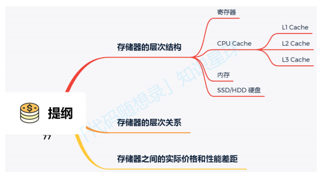
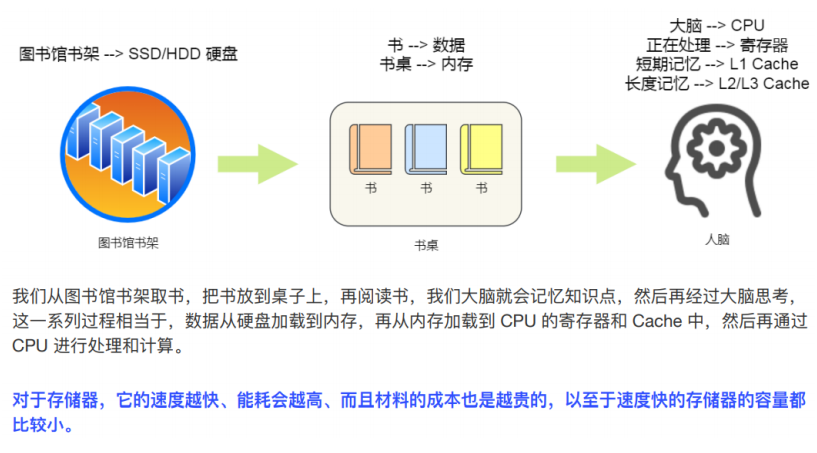
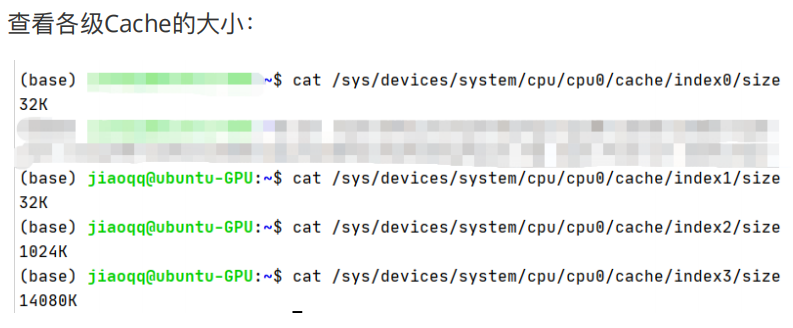
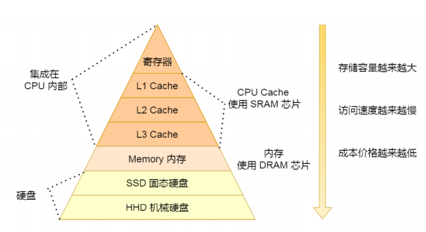
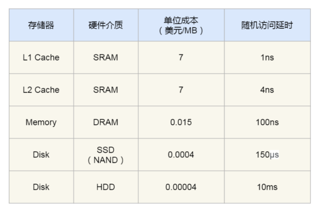
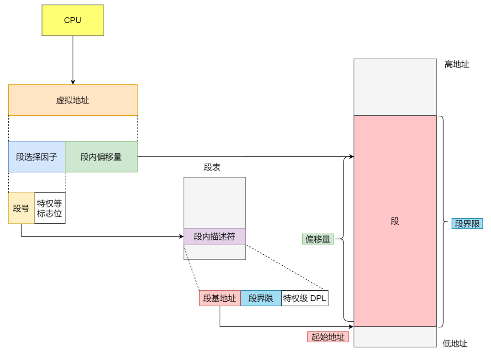
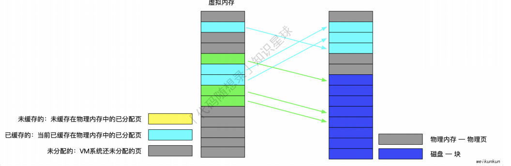
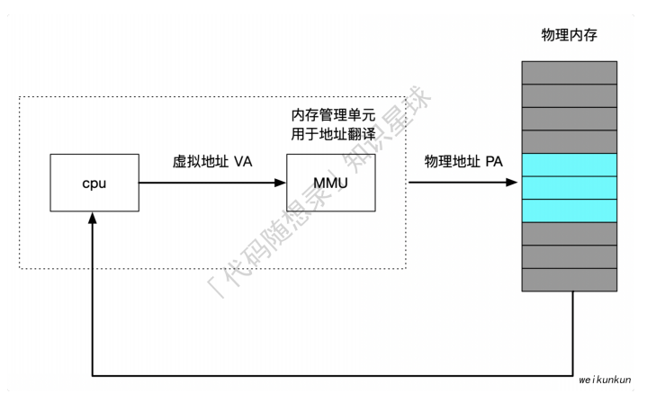
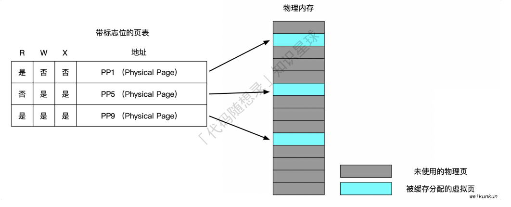
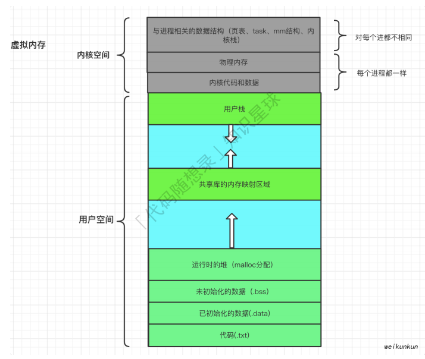

# 存储系统

## 存储系统层级

### 存储器的层次结构

#### 寄存器

寄存器的访问速度⾮常快，⼀般要求在半个 CPU 时钟周期内完成读写，CPU 时钟周期跟 CPU 主频息息相关，⽐如`2 GHz` 主频的 CPU，那么它的时钟周期就是 `1/2G`，也就是 `0.5ns（纳秒）`。

#### CPU Cache

CPU Cache（⽤的是⼀种叫 SRAM（Static Random-Access Memory，静态随机存储器）的芯⽚）
SRAM 之所以叫「静态」存储器，是因为只要有电，数据就可以保持存在，⽽⼀旦断电，数据就会丢失了。
CPU Cache 通常分为三层，如下图所示：

#### 内存

内存⽤的芯⽚和 CPU Cache 有所不同，它使⽤的是⼀种叫作 DRAM （Dynamic Random Access Memory，动态随机存取存储器） 的芯⽚。相⽐ SRAM，DRAM 的密度更⾼，功耗更低，有更⼤的容量，⽽且造价⽐ SRAM 芯⽚便宜很多。
DRAM 存储⼀个 bit 数据，只需要⼀个晶体管和⼀个电容就能存储，但是因为数据会被存储在电容⾥，电容会不断漏电，所以需要「定时刷新」电容，才能保证数据不会被丢失，这就是 DRAM 之所以被称为「动态」存储器的原因，只有不断刷新，数据才能被存储起来。
DRAM 的数据访问电路和刷新电路都⽐ SRAM 更复杂，所以访问的速度会更慢，内存速度⼤概在 200~300 个 时钟周期之间。

#### SSD/HDD硬盘

SSD（Solid-state disk） 就是我们常说的固体硬盘，结构和内存类似，但是它相⽐内存的优点是断电后数据还是存在的，⽽内存、寄存器、⾼速缓存断电后数据都会丢失。内存的读写速度⽐ SSD ⼤概快 10~1000 倍。
机械硬盘（Hard Disk Drive, HDD），它是通过物理读写的⽅式来访问 数据的，因此它访问速度是⾮常慢的，它的速度⽐内存慢 10W 倍左右。

### 存储器的层次关系

CPU 并不会直接和每⼀种存储器设备直接打交道，⽽是每⼀种存储器设备只和它相邻的存储器设备打交道。

所以，每个存储器只和相邻的⼀层存储器设备打交道，并且存储设备为了追求更快的速度，所需的材料成本必然也是更⾼，也正因为成本太⾼，所以 CPU 内部的寄存器、L1\L2\L3 Cache 只好⽤较⼩的容量，相反内存、硬盘则可⽤更⼤的容量，这就我们今天所说的存储器层次结构。

### 存储器之间的实际价格和性能差距

不同层级的存储器之间的成本对⽐图：

机械硬盘(HDD)到底有多慢：

- SSD比机械硬盘快70倍左右
- 内存比机械硬盘快100000倍左右
- CPU L1 Cache比机械硬盘快10000000倍左右

## 分段

虚拟内存采⽤的是分⻚技术，也就是将地址空间划分成固定⼤⼩的⻚，每⼀⻚再与内存进⾏映射。
如果使⽤分⻚系统的⼀维地址空间，动态增⻓的特点会导致覆盖问题的出现。
分段的做法是把每个表分成段，⼀个段构成⼀个独⽴的地址空间。
每个段的⻓度可以不同，并且可以动态增⻓。

### 内存分段

内存分段将物理内存划分成不同的逻辑段或区域，每个段⽤于存储特定类型的数据或执⾏特定类型的任务。每个段具有不同的⼤⼩和属性。常⻅的段包括代码段（存储程序执⾏代码）、数据段（存储程序数据）、堆栈段（存储函数调⽤和局部变量），以及其他⾃定义段，如共享库段等。
分段机制下的虚拟地址由两部分组成，段选择因⼦和段内偏移量，⽽虚拟地址是通过段表与物理地址进⾏映射的。

段选择因⼦中的段号与段表对应，作为段表的索引。段表⾥⾯保存的是这个段的基地址、段的界限和特权等级等。
虚拟地址中的段内偏移量应该位于 0 和段界限之间，如果段内偏移量是合法的，就将段基地址加上段内偏移量得到物理内存地址。

### 纯分段

分段和分⻚本质上是不同的，⻚⾯是定⻓的⽽段不是。

优点：
(1) 共享：有助于⼏个进程之间共享过程和数据。 ⽐如共享库
(2) 保护：每个段都可以独⽴地增⼤或减⼩⽽不会影响其他的段

### 分段和分⻚结合

程序的地址空间划分成多个拥有独⽴地址空间的段，每个段上的地址空间划分成⼤⼩相同的⻚。
这样既拥有分段系统的共享和保护，⼜拥有分⻚系统的虚拟内存功能

### 分段与分⻚的⽐较

**对程序员的透明性**：
分⻚透明，但是分段需要程序员显式划分每个段。

**地址空间的维度**：
分⻚是⼀维地址空间，分段是⼆维的。

**⼤⼩是否可以改变**：
⻚的⼤⼩不可变，段的⼤⼩可以动态改变。

**出现的原因**：
分⻚主要⽤于实现虚拟内存，从⽽获得更⼤的地址空间；分段主要是为了使程序和数据可以被划分为逻辑上独⽴的地址空间并且有助于共享和保护。

## 内存碎⽚

内存碎⽚是指内存中的空闲空间被分割成多个不连续的⼩块，⽽不是⼀个连续的⼤块。这些⼩块空闲内存可能分布在整个内存地址空间中，导致内存资源的不充分利⽤。

外部碎⽚：虽然整体内存容量⾜够，但⽆法为较⼤的内存请求分配连续的内存块，因为已分配的内存块分散在内存中，它们之间的未分配空间太⼩。

内部碎⽚：有时分配的内存块⼤于进程实际需要的内存量，这意味着有⼀些内存浪费在内部碎⽚中。

## 内存分⻚

### ⻚⾯置换算法

#### 最佳⻚⾯置换算法(OPT)

置换在「未来」最⻓时间不访问的⻚⾯,但是实际系统中⽆法实现，因为程序访问⻚⾯时是动态的我们是⽆法预知每个⻚⾯在「下⼀次」访问前的等待时间，因此作为实际算法效率衡量标准。

#### 先进先出置换算法(FIFO)

顾名思义，将⻚⾯以队列形式保存，先进⼊队列的⻚⾯先被置换进⼊磁盘。

#### 最近最久未使⽤的置换算法（LRU）

根据⻚⾯未被访问时⻓⽤升序列表将⻚⾯排列，每次将最久未被使⽤⻚⾯置换出去。

#### 时钟⻚⾯置换算法

把所有的⻚⾯都保存在⼀个类似钟⾯的「环形链表」中，⻚⾯包含⼀个访问位。
当发⽣缺⻚中断时，顺时针遍历⻚⾯，如果访问位为1，将其改为0，继续遍历，直到访问到访问位为0⻚⾯，进⾏置换。

#### 最不常⽤算法

记录每个⻚⾯访问次数，当发⽣缺⻚中断时候，将访问次数最少的⻚⾯置换出去，此⽅法需要对每个⻚⾯访问次数统计，额外开销。

## 虚拟内存

虚拟内存是计算机操作系统中的⼀种内存管理技术，虚拟地址空间构成虚拟内存，它使得应⽤程序认为⾃⼰拥有连续的可⽤内存空间，但实际上是被分隔的多个物理内存⻚、以及部分暂时存储在磁盘上的交换分区所构成的。虚拟内存的实现通过硬件异常、硬件地址翻译、主存、磁盘以及内核软件共同完成。

它允许程序访问⽐物理内存（RAM）更⼤的地址空间，但⾸先我们要区分这两个概念：

- 虚拟内存地址：程序所使⽤的内存地址
- 物理内存地址：实际存在硬件⾥⾯的空间地址

操作系统会提供⼀种机制，在物理内存和虚拟内存之间建⽴⼀个地址映射表，进程持有的虚拟地址会通过 CPU 芯⽚中的内存管理单元（MMU）的映射关系，来转换变成物理地址，然后再通过物理地址访问内存

操作系统主要通过**内存分段**和**内存分⻚**来管理虚拟内存和物理内存之间的关系。

### 地址空间

地址空间是物理内存的抽象，是⼀个进程可⽤于寻址内存的⼀套地址集合。

### 分⻚

地址空间被分割成多个块，每⼀块称作⼀⻚或⻚⾯(Page)。每⼀⻚有连续的地址范围，这些⻚被映射到连续的物理内存(⻚框)。

### ⻚表

⻚表的⽬的是把虚拟⻚⾯(虚拟地址)映射为⻚框(物理地址)。⻚表给出了虚拟地址与物理地址的映射关系。从数学的⻆度说⻚表是⼀个函数，他的参数是虚拟⻚号，结果是物理⻚⻚框号

### 加速分⻚

#### TLB 加速分⻚

概念：将虚拟地址直接映射到物理地址，⽽不必再访问⻚表，这种设备被称为转换检测缓冲区（TLB）、相联存储器或快表

⼯作过程：将⼀个虚拟地址放⼊MMU中进⾏转换时，硬件⾸先通过将该虚拟⻚号与TLB中所有表项同时进⾏匹配，判断虚拟⻚⾯是否在其中：

1. 虚拟⻚号在TLB中。如果MMU检测⼀个有效的匹配并且访问操作并不违反保护位，则将⻚框号直接从TLB中取出⽽不必访问⻚表。
2. 虚拟⻚号不在TLB中。如果MMU检测到没有有效的匹配项就会进⾏正常的⻚表查询。接着从TLB中淘汰⼀个表项，然后⽤新的⻚表项替换它。

#### 软件TLB管理

### 针对⼤内存的⻚表

（1）多级⻚表

（2）倒排⻚表

### 三个重要的能⼒

#### ⾼速缓存

按照存储器层次结构中的缓存划分来看，将位于k层的更⼩更快的存储设备作为存储在k+1层的更⼤更慢的存储设备的缓存。具体如下：

在虚拟内存中的虚拟⻚共分为三种类型：

1. 未分配（没有被进程申请使⽤的，也就是空闲的虚拟内存， 不占⽤虚拟内存磁盘的任何空间）
2. 未缓存（仅仅加载到磁盘中的⻚）
3. 已缓存（已经加载到内存中的内存⻚（⻚框））

#### 内存管理

#### 内存保护

现代操作系统中，⽤户进程不应该被允许修改它的只读代码段;
⽽且也不应该允许它读取或修改任何内核中的代码和数据结构;
并且也不允许其读取或者修改其他进程的私有内存，以及修改和其他进程共享的虚拟⻚⾯。
如果不对进程的内存访问进⾏限制，攻击者就能够访问和修改其他进程的私有内存，进⽽导致整个系统崩溃。⼤体的虚拟寻址如下：

通过MMU，每次都会读取⻚表中的⼀个⻚表条⽬(PTE)，通过在这些⻚表条⽬(PTE)中添加⼀些标志位，就能够实现对⼀个虚拟⻚的访问控制权限。譬如：

### 相关的其他概念

#### ⽤户态和内核态

为了使操作系统内核提供⼀个⽆懈可击的进程抽象，处理器必须提供⼀种机制，限制⼀个应⽤可以执⾏的指令以及他可以⽤来访问的地址空间范围。
处理器通常是⽤某个控制寄存器中的⼀个模式位来提供这种观功能的，该寄存器描述了进程当前享有的特权。

当设置了模式位时：

- 进程就运⾏在内核态中。
- 运⾏在内核态中的进程可以执⾏指令集中的任何指令，并且可以访问系统中的任何内存位置。

没有设置模式位时：

- 进程就运⾏在⽤户态。⽤户模式中的进程不允许执⾏特权指令。

⽐如：停⽌处理器、改变模式位、或者发起⼀个I/O操作。同时也不允许⽤户态下的进程直接引⽤地址空间中内核空间的代码和数据。
任何这样的尝试都会导致致命的保护故障。⽤户态下的程序必须通过系统调⽤接⼝间接的访问内核代码和数据。

#### 上下⽂切换

上下⽂切换属于⼀种较⾼层形式的异常控制流，进⾏上下切换涉及到的内容如下：

1. 各种寄存器，TLB 也是其中之⼀。
2. 程序计数器
3. ⽤户栈
4. 内核栈
5. 内核中的各种数据结构
   1. ⻚表
   2. task_struct
   3. mm_struc

### ⼩总结

虚拟内存的思想，整体来看就是：通过结合磁盘和内存各⾃的优势，利⽤中间层对资源进⾏更合理地调度，充分提⾼资源的利⽤率。并提供和谐以及统⼀的抽象。
为什么需要虚拟内存：(摘⾃ 为什么Linux需要虚拟内存⼀⽂)

1. 虚拟内存可以结合磁盘和物理内存的优势为进程提供看起来速度⾜够快并且容量⾜够⼤的存储
2. 虚拟内存可以为进程提供独⽴的内存空间并引⼊多层的⻚表结构将虚拟内存翻译成物理内存，进程之间可以共
享物理内存减少开销，也能简化程序的链接、装载以及内存分配过程;
3. 虚拟内存可以控制进程对物理内存的访问，隔离不同进程的访问权限，提⾼系统的安全性。
