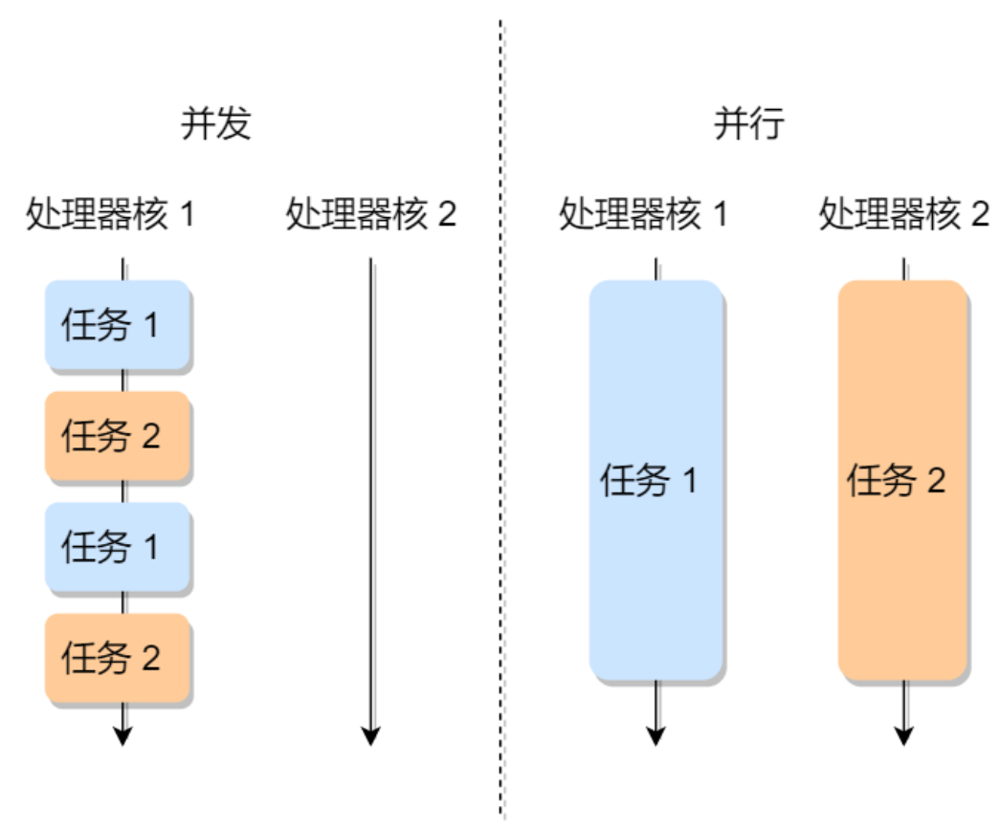
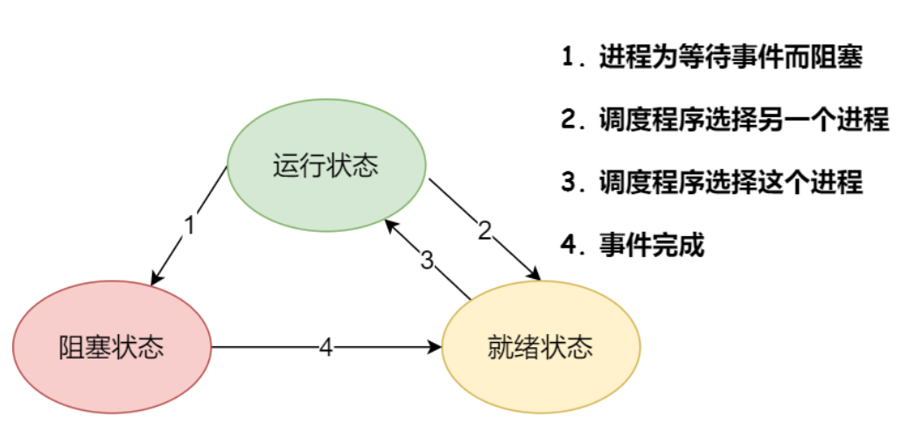
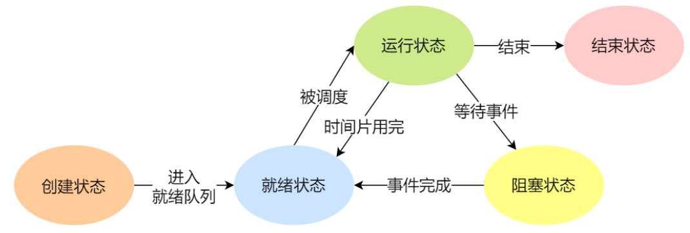
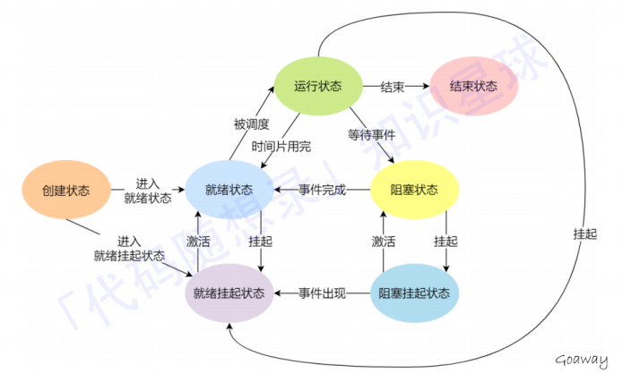
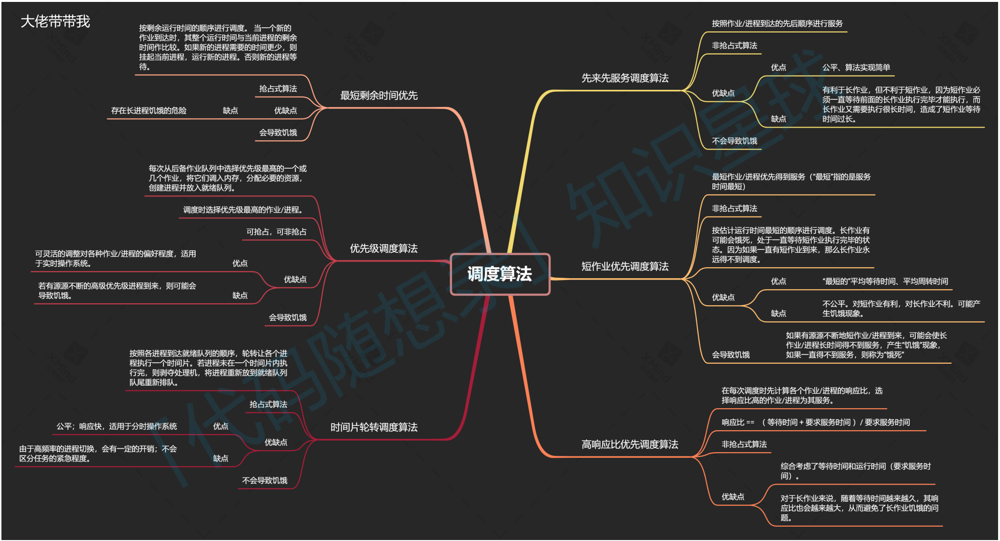
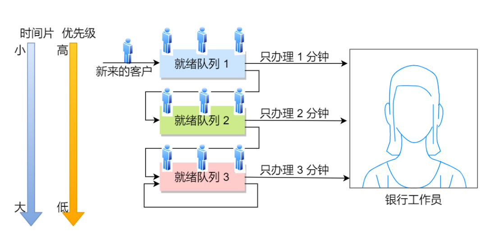
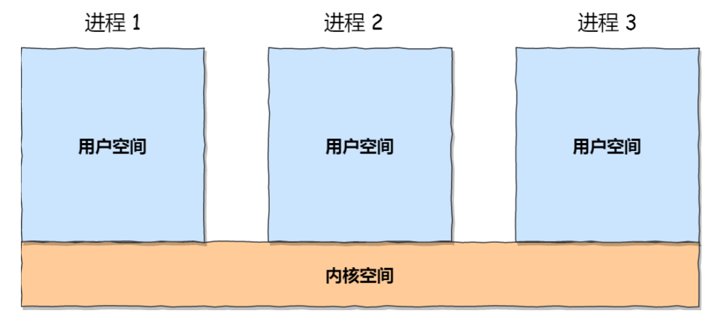
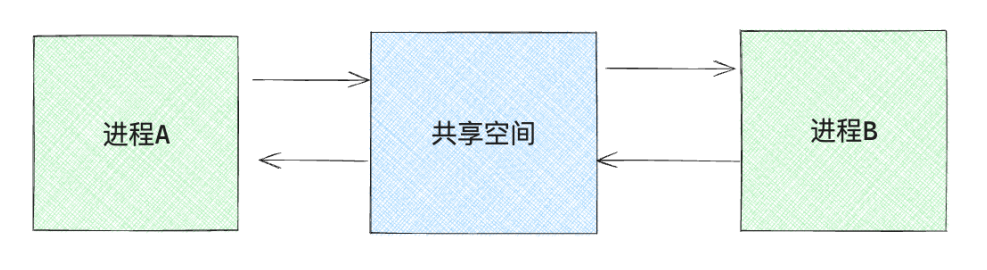
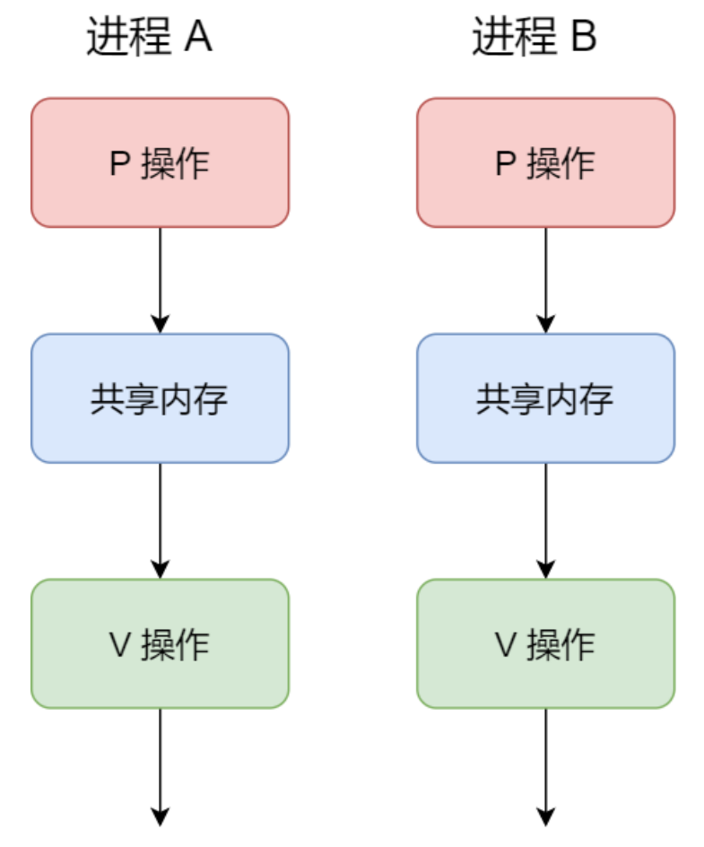
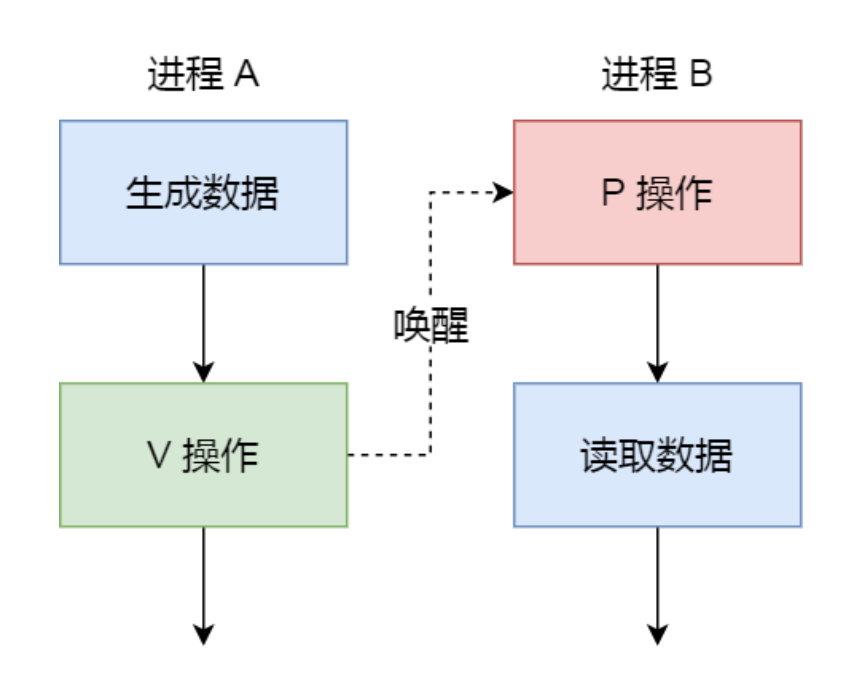

# 操作系统

## 操作系统基础

### 什么是操作系统

操作系统(Operating System)，是介于硬件资源和应⽤程序之间的⼀个系统软件 ，能控制和管理整个计算机系统的硬件和软件资源，调度计算机的⼯作与资源的分配，进⽽为⽤户和其他软件提供服务，操作系统是计算机系统中最基本的系统软件。

如果将它理解为“掌控计算机的系统”是否更能精确的描述OS所做的事情呢？

如果要更深⼊的掌握这个问题，可以问⼀问：如果没有了操作系统，你使⽤的PC机还能⼲什么？或者说，你能够使⽤你的PC机做什么呢？

### 操作系统的特征

- 并发：并发指的是两个或多个事件在同⼀时间间隔内发⽣，计算机系统中同时存在多个运⾏的程序，因此具有处理和调度多个程序同时执⾏的能⼒。
    >⚠ 注意：并⾏和并发的区别：并发指的是同⼀时间间隔，并⾏指的是同⼀时刻。
- 共享：系统中的资源可以供内存中多个并发执⾏的进程共同使⽤。
  - 互斥共享：⼀段时间内只允许⼀个进程访问该资源。⼀段时间内只允许⼀个进程访问的资源称为临界资源。
  - 同时访问：⼀段时间内允许多个进程“同时”访问，“同时”通常是宏观的，实际上是交替的对该资源进⾏访问。
- 虚拟：把⼀个物理上的实体变为若⼲逻辑上的对应物。
- 异步：进程的执⾏并不是⼀贯到底的，⽽是以不可预知的速度向前推进。

### 操作系统的功能

>操作系统位于硬件资源之上，管理硬件资源; 应⽤程序之下，为应⽤程序提供服务，同时管理应⽤程序

1. 资源分配，资源回收
计算机必要重要的硬件资源⽆⾮就是 CPU、内存、硬盘、I/O设备。
⽽这些资源总是有限的，因此需要有效管理，资源管理最终只有两个问题：资源分配、资源回收。
**资源分配：**体现在CPU上，⽐如进程调度，多个进程同时请求CPU下，应该给哪⼀个进程呢？再⽐如内存分配，内存不够了怎么办？A进程⾮法访问了B进程的内存地址怎么办？内存内、外碎⽚问题等。
**资源回收：**考虑内存回收后的合并等等。

2. 为应⽤程序提供服务
操作系统将硬件资源的操作封装起来，提供相对统⼀的接⼝（系统调⽤）供开发者调⽤。
如果没有操作系统，应⽤程序将直接⾯对硬件，除去给开发者带来的编程困难不说，直接访问硬件，使⽤不当极有可能直接损坏硬件资源。

3. 管理应⽤程序
即控制进程的⽣命周期：进程开始时的环境配置和资源分配、进程结束后的资源回收、进程调度等。

4. 操作系统内核的功能
   1. 进程调度能⼒： 管理进程、线程，决定哪个进程、线程使⽤CPU。
   2. 内存管理能⼒： 决定内存的分配和回收。
   3. 硬件通信能⼒： 管理硬件，为进程和硬件之间提供通信。
   4. 系统调⽤能⼒： 应⽤程序进⾏更⾼限权运⾏的服务，需要系统调⽤，⽤户程序和操作系统之间的接⼝。

### 操作系统的⻆⾊

1. 管理者
    主要分为：CPU管理、内存管理、外存管理、IO管理；以及⾃⼰的健壮性和安全性管理。
    >健壮性，⼜称鲁棒性，即使很粗鲁的对待程序，它还是可以很好的运⾏。

2. 魔术师:
    ⽐如操作系统会让每个进程都觉得⾃⼰独占CPU、独占整⽚物理内存，⽽实际上每个进程都只是在某⼀时间段内占⽤CPU，仅仅只是占⽤实际⼀点点物理内存。

### ⽤户程序与操作系统的关系

>⽤户程序和操作系统之间是相互调⽤的关系

1. 操作系统的⻆度
计算机启动后启动的第⼀个软件就是操作系统，随后启动的所有进程都运⾏在操作系统之上，使⽤操作系统提供的服务，同时被操作系统监控，进程结束后也由操作系统回收。
2. 进程⻆度
调⽤操作系统提供的服务，实现⾃⼰的功能。

## 进程和线程

### 进程基础

#### 进程的概念

我们编写的代码只是⼀个存储在硬盘的静态⽂件，通过编译后就会⽣成⼆进制可执⾏⽂件，当我们运⾏这个可执⾏⽂件后，它会被装载到内存中，接着 CPU 会执⾏程序中的每⼀条指令，那么这个**运⾏中的程序，就被称为「进程」(Process)**。
根据上⾯的过程，我们可以得到进程的其中⼀个定义：**进程是具有独⽴功能的程序在⼀个数据集合上运⾏的过程，是系统进⾏资源分配和调度的⼀个独⽴单位。**

#### 进程控制块（PCB）

系统通过 进程控制块PCB 来描述进程的基本情况和运⾏状态，就进⽽控制和管理进程，它是进程存在的唯⼀标识，
其包括以下信息：

1. 进程描述信息： 进程标识符、⽤户标识符
2. 进程控制和管理信息： 进程当前状态，进程优先级
3. 进程资源分配清单： 有关内存地址空间或虚拟地址空间的信息，所打开⽂件的列表和所使⽤的 I/O 设备信息。
4. CPU相关信息： 当进程切换时，CPU寄存器的值都被保存在相应PCB中，以便CPU重新执⾏该进程时能从断点处继续执⾏;

`PCB`通常是通过链表的⽅式进⾏组织，把具有相同状态的进程链在⼀起，组成各种队列。

#### 并发与并⾏

1. 单个处理核在很短时间内分别执⾏多个进程，称为并发
2. 多个处理核同时执⾏多个进程称为并⾏
3. 对于并发来说，CPU需要从⼀个进程切换到另⼀个进程，在切换前必须要记录当前进程中运⾏的状态信息，以备下次切换回来的时候可以恢复执⾏。


#### 进程的状态切换

我们知道了并发会执⾏进程的切换，这就需要进程有运⾏状态和停⽌状态，实际上某个进程在某个时刻所处的状态分为以下⼏种状态：

- 运⾏态： 该时刻进程占⽤CPU
- 就绪态：可运⾏，由于其他进程处于运⾏状态⽽暂时停⽌运⾏
- 阻塞态：该进程正在等待某⼀事件发⽣（如等待输⼊/输出操作的完成）⽽暂时停⽌运⾏
- 

当然，进程还有另外两个基本状态：

- 创建状态（new）：进程正在被创建时的状态；
- 结束状态（Exit）：进程正在从系统中消失时的状态；



如果有⼤量处于阻塞状态的进程，进程可能会占⽤着物理内存空间，所以系统通常会把阻塞状态的进程的物理内存空间换出到硬盘，等需要再次运⾏的时候，再从硬盘换⼊到物理内存，那么，就需要⼀个新的状态，来描述进程没有占⽤实际的物理内存空间的情况，这个状态就是挂起状态。这跟阻塞状态是不⼀样，阻塞状态是等待某个事件的返回。
挂起状态可以分为两种:

- 阻塞挂起状态：进程在外存（硬盘）并等待某个事件的出现；
- 就绪挂起状态：进程在外存（硬盘），但只要进⼊内存，即刻⽴刻运⾏；



特点：

1. 只有就绪态和运⾏态可以相互转换，其它的都是单向转换。就绪态的进程通过调度算法从⽽获得CPU 时间，转为运⾏状态；
2. 运⾏态的进程，在分配给它的 CPU 时间⽚⽤完之后就会转为就绪状态，等待下⼀次调度。
3. 阻塞态是因缺少需要的资源从⽽由运⾏态转换⽽来，但是该资源不包括 CPU 时间，缺少 CPU 时间会从运⾏态转换为就绪态。
4. 当进程等待的外部事件发⽣时（如⼀些输⼊到达），则由阻塞态转换为就绪态，如果此时没有其他进程运⾏，则转换为运⾏态，否则该进程将处于就绪态，等待CPU空闲轮到它运⾏。

#### 进程的上下⽂切换

⼀个进程切换到另⼀个进程运⾏，称为进程的上下⽂切换, **进程的上下⽂切换不仅包含了虚拟内存、栈、全局变量等⽤户空间的资源，还包括了内核堆栈、寄存器等内核空间的资源。**

发⽣进程上下⽂切换有哪些场景:

- 进程的时间⽚耗尽
- 阻塞等待
- ⾼优先级进程运⾏
- 中断处理
- 进程通过睡眠函数 sleep 这样的⽅法将⾃⼰主动挂起

#### 进程的创建

⼀个进程可以创建另⼀个进程，此时创建者为⽗进程，被创建的进程为⼦进程，操作系统创建⼀个新进程的过程如
下：

- 为新进程分配⼀个独特的进程控制块（PCB）
- 为新进程分配所需要的资源，⽐如内存、CPU时间
- 初始化进程控制块（PCB）的各种字段，包括状态、优先级、寄存器初始值等。
- 将其状态设置为就绪状态，使其能够被调度执⾏。进程进⼊就绪队列，等待分配处理器时间。

#### 进程的终⽌

- 根据标识符，查找需要终⽌的进程的 PCB；
- 如果进程处于执⾏状态，则⽴即终⽌该进程的执⾏，然后将处理器资源分配给其他进程；
- 如果其还有⼦进程，则应将该进程的⼦进程交给 1 号进程接管；
- 将该进程所拥有的全部资源都归还给操作系统；
- 将其从 PCB 所在队列中删除；

#### 进程的阻塞

- 找到被阻塞进程的标识符对应的PCB
- 如果该进程为运⾏状态，则保护其现场，将其状态转为阻塞状态，停⽌运⾏；
- 将该 PCB 插⼊到等待队列中，将处理机资源调度给其他就绪进程

#### 进程的唤醒

- 在该事件的阻塞队列中找到相应进程的 PCB；
- 将其从阻塞队列中移出，并置其状态为就绪状态；
- 把该 PCB 插⼊到就绪队列中，等待调度程序调度；

### 线程基础

#### 什么是线程？

线程是“轻量级线程”，是进程中的⼀个实体，是程序执⾏的最⼩单元，也是**被系统独⽴调度和分配的基本单位**。
**线程是进程当中的⼀条执⾏流程**，同⼀个进程内多个线程之间可以共享代码段、数据段、打开的⽂件等资源，但每个线程各⾃都有⼀套独⽴的寄存器和栈，这样可以确保线程的控制流是相对独⽴的。

#### 线程的特点

- 线程是⼀个“轻量级线程”，⼀个进程中可以有多个线程，线程不拥有系统资源，但是也有PCB，创建线程使⽤的底层函数和进程⼀样，都是clone。
- 各个线程之间可以并发执⾏。
- 同⼀个进程中的各个线程共享该进程所拥有的资源。
- 进程可以蜕变成线程。

实际上，⽆论是创建进程的fork，还是创建线程的 `pthread_create`，底层实现都是调⽤同⼀个内核函数`clone`。

1. 如果复制对⽅的地址空间，那么就产出⼀个“进程”;
2. 如果共享对⽅的地址空间，就产⽣⼀个“线程”。

Linux内核是不区分进程和线程的, 只在⽤户层⾯上进⾏区分。所以，线程所有操作函数 `pthread_*` 是库函数，⽽⾮系统调⽤。

#### 进程和线程的⽐较

>进程是资源（包括内存、打开的⽂件等）分配的单位，线程是 CPU 调度的单位；

- 资源：进程是系统中拥有资源的基本单位，⽽线程不拥有系统资源（仅有⼀点必不可少的能保证运⾏的资源，⽐如寄存器和栈），但线程可以访问⾪属进程的系统资源。
- 调度：线程切换的代价远低于进程，在同⼀个进程中，线程的切换不会引起进程切换，⽽从⼀个进程中的线程切换到另⼀个进程中的线程中，会引起进程切换。
- 并发：进程可以并发执⾏，⽽⼀个进程中的多个线程之间也能并发执⾏，甚⾄不同进程中的线程也能并发执⾏，从⽽使得操作系统拥有更好的并发性，提⾼了系统资源的利⽤率和系统的吞吐量。
- 独⽴性：每个进程都拥有独⽴的地址空间和资源、除了共享全局变量，不允许其他进程访问。某进程中的线程对其他进程都不可⻅，同⼀进程中的不同线程是为了提⾼并发性以及进⾏相互之间的合作⽽创建的，它们共享进程的地址空间和资源
- 系统开销：线程所需要的开销⽐进程⼩
  - 线程的创建时间⽐进程快，因为进程在创建的过程中，还需要资源管理信息，⽐如内存管理信息、⽂件管理信息，⽽线程在创建的过程中，不会涉及这些资源管理信息，⽽是共享它们；
  - 线程的终⽌时间⽐进程快，因为线程释放的资源相⽐进程少很多；
  - 同⼀个进程内的线程切换⽐进程切换快，因为线程具有相同的地址空间（虚拟内存共享），这意味着同⼀个进程的线程都具有同⼀个⻚表，那么在切换的时候不需要切换⻚表。⽽对于进程之间的切换，切换的时候要把⻚表给切换掉，⽽⻚表的切换过程开销是⽐较⼤的；
  - 由于同⼀进程的各线程间共享内存和⽂件资源，那么在线程之间数据传递的时候，就不需要经过内核了，这就使得线程之间的数据交互效率更⾼了；

所以，不管是时间效率，还是空间效率线程⽐进程都要⾼。

#### 线程的状态

- 执⾏状态：线程获得处理机正在执⾏
- 就绪状态：线程已经具备执⾏条件，只需要获得CPU就可以执⾏
- 阻塞状态：线程在执⾏中因事件受阻⽽处于暂停状态

#### 线程的实现

##### ⽤户线程(ULT)

⽤户线程是在⽤户空间实现的线程，不是由内核管理的线程，整个线程管理和调度，操作系统是不直接参与的，⽽是由⽤户级线程库函数来完成线程的管理，包括线程的创建、终⽌、同步和调度等。

优点：

1. 线程切换不需要切换到内核空间中，节省了模式切换的开销。
2. 调度算法可以是进程专⽤的，不同的进程可根据⾃身的需要，对⾃⼰的线程选择不同的调度算法。
3. ⽤户级线程的实现与操作系统平台⽆关，对线程管理的代码是属于⽤户程序的⼀部分。

缺点：

1. 由于不由操作系统调度，⼀旦⽤户线程发起系统调⽤⽽阻塞，那么此进程下⽤户线程都⽆法运⾏;
2. ⼀旦某个⽤户线程正在运⾏，只有当其交出CPU执⾏权，其他⽤户线程才可以运⾏，⽆法被打断，因为只有操作系统才有权限打断运⾏，但是操作系统不直接参与调度;
3. 由于时间⽚分配给进程，故与其他进程⽐，在多线程执⾏时，每个线程得到的时间⽚较少，执⾏会⽐较慢；

##### 内核线程(KLT)

由操作系统管理、调度，其对应的TCB是存放在内核中，这样线程的创建、终⽌和管理都是由操作系统负责。

优点：

1. 当⼀个内核线程发起系统调⽤阻塞时不会影响其它内核线程的执⾏;
2. 分配给线程，多线程的进程获得更多的 CPU 运⾏时间；

缺点：

1. 在⽀持内核线程的操作系统中，由内核来维护进程和线程的上下⽂信息，如 PCB 和 TCB；
2. 线程的创建、终⽌和切换都是通过系统调⽤的⽅式来进⾏，因此对于系统来说，系统开销⽐较⼤；

##### 轻量级线程(LWP)

**轻量级进程是内核⽀持的⽤户线程，⼀个进程可有⼀个或多个 LWP，每个 LWP 是跟内核线程⼀对⼀映射的，也就是 LWP 都是由⼀个内核线程⽀持，⽽且 LWP 是由内核管理并像普通进程⼀样被调度。**

#### 线程共享资源

- ⽂件描述符表
- 每种信号的处理⽅式
- 当前⼯作⽬录
- ⽤户ID和组ID

#### 线程⾮共享资源

- 线程id
- 处理器现场和栈指针(内核栈)
- 独⽴的栈空间(⽤户空间栈)
- errno变量
- 信号屏蔽字
- 调度优先级

#### 线程的优缺点

优点：

- 提⾼程序并发性
- 开销⼩
- 数据通信、共享数据⽅便

缺点：

- 库函数，不稳定
- 调试、编写困难、gdb不⽀持
- 对信号⽀持不好

#### 线程如何减少开销

1. 线程创建快，进程创建需要资源管理信息，⽐如内存管理信息和⽂件管理信息，⽽线程创建后是共享其所属进程的资源管理信息;
2. 线程终⽌时间快，需要回收的仅有少量寄存器和私有的栈区;
3. 线程切换快，因为线程切换仅涉及到少量寄存器和栈区，⽽进程上下⽂切换有CPU寄存器和程序计数器(CPU上下⽂)、虚拟内存空间、⻚表切换等;
4. 线程因为创建时共享了其所属进程绝⼤多数资源，因此天⽣具有很好的线程间通信交互效率。

### 进程调度

当⼀个进程的状态发⽣改变时，操作系统需要考虑是否要换⼀个进程执⾏，这就需要⽤到“进程调度算法”

#### 调度⽬标

不同的调度算法具有不同的特性，因为使⽤以下标准⽐较处理机调度算法的性能：

- CPU利⽤率：CPU是计算机系统中最重要和昂贵的资源之⼀，应该使CPU保持“忙碌”状态
- 系统吞吐量：单位时间内CPU完成作业的数量。
- 周转时间：作业从提交到作业完成所需要的时间，是作业等待、在就绪队列中排队、在处理机上运⾏及输⼊输出操作所花费时间的总和。
- 等待时间：进程处于等处理机（处于就绪队列）的时间之和，等待时间越⻓，⽤户满意度越低。
- 响应时间：⽤户提交请求到系统⾸次产⽣响应所需要的时间。

#### 进程调度⽅式

- ⾮抢占调度⽅式：当⼀个进程正在处理中，即使有更为重要的进程进⼊到就绪队列中，仍然让正在执⾏的进程继续执⾏。
- 抢占调度⽅式：当⼀个进程正在处理中，如果有更为重要的进程进⼊到就绪队列中，则允许调度程序根据某种原则去暂停正在执⾏的进程，将处理机分配给这个更为重要或紧迫的进程。

### 调度算法



#### 先来先服务调度算法(FCFS)

**每次从就绪队列选择最先进⼊队列的进程，然后⼀直运⾏，直到进程退出或被阻塞，才会继续从队列中选择第⼀个进程接着运⾏**。
这种算法虽然看上去公平，但是如果有⼀个⻓作业需要处理，则后⾯的短作业需要处理很⻓时间。
先来先调度算法的特点是算法简单，对⻓作业⽐较有利，对短作业不利，适⽤于 CPU 繁忙型作业的系统，⽽不适⽤于 I/O 繁忙型作业的系统。

.png)

#### 最短作业优先调度算法（SJF）

最短作业优先调度算法从就绪队列中选择⼀个估计运⾏时间最短的作业，将之调⼊到内存中运⾏，这有利于提⾼系统的吞吐量。
但是这对⻓作业⼗分不利，由于调度程序总是优先调度短作业，将会导致⻓作业⻓期不被调度，此外该算法也没有考虑到作业的紧迫程度，因此不能保证紧迫性作业会被及时处理。

.png)

#### ⾼响应⽐优先调度算法

每次进⾏进程调度时，先计算「响应⽐优先级」，然后把「响应⽐优先级」最⾼的进程投⼊运⾏

$优先权 = (等待时间 + 要求服务时间) / 要求服务时间$

根据公式可以知道：

- 作业的等待时间相同时，如果要求服务时间越短，则响应⽐更⾼，有利于短作业执⾏
- 当要求服务时间相同时，响应⽐由等待时间决定，如果等待时间越⻓，则响应⽐越⾼
- 对于⻓作业，作业的响应⽐可以随着等待时间的增加⽽提⾼

#### 时间⽚轮转调度算法

每个进程被分配⼀个时间段，称为时间⽚（Quantum），即允许该进程在该时间段中运⾏。

- 如果时间⽚⽤完，进程还在运⾏，那么将会把此进程从 CPU 释放出来，并把 CPU 分配给另外⼀个进程；
- 如果该进程在时间⽚结束前阻塞或结束，则 CPU ⽴即进⾏切换；

另外，时间⽚的⻓度就是⼀个很关键的点：

- 如果时间⽚设得太短会导致过多的进程上下⽂切换，降低了 CPU 效率；
- 如果设得太⻓⼜可能引起对短作业进程的响应时间变⻓。将

⼀般来说，时间⽚设为 20ms~50ms 通常是⼀个⽐较合理的折中值。


#### 最⾼优先级调度算法

从就绪队列中选择最⾼优先级的进程进⾏运⾏，但进程的优先级可以分为静态优先级和动态优先级

- 静态优先级：优先级在创建进程时已经确定，在进程运⾏期间保持不变，确定静态优先级的主要依据有进程类型，对资源的要求，⽤户要求。
- 动态优先级：进程运⾏过程中，根据进程运⾏时间和等待时间等因素调整进程的优先级

但是这种算法可能会导致低优先级的进程永远不被执⾏。


#### 多级队列调度算法

上⾯的各种调度算法是固定且单⼀的，⽆法满⾜系统中不同⽤户对进程调度策略的不同要求，多级队列调度算法在系统中设置多个就绪队列，将不同类型或性质的进程固定分配到不同的就绪队列，每个队列可以实施不同的调度算法。

#### 多级反馈队列调度算法

多级反馈队列调度算法融合了时间⽚轮转调度算法和优先级调度算法，通过动态调整进程的优先级和时间⽚⼤⼩，多级反馈队列调度算法可以兼顾多⽅⾯的系统⽬标

多级反馈队列调度算法的实现思想如下：

- 设置多个就绪队列，并为每个队列赋予不同的优先级。第1级队列的优先级最⾼，第2级队列的优先级次之，其余队列的优先级逐个降低。
- 赋予各个队列的进程运⾏时间⽚的⼤⼩各不相同。在优先级越⾼的队列中，每个进程的时间⽚就越⼩。例如，第 i+1 级队列的时间⽚要⽐第i级队列的时间⽚⻓1倍。
- 每个队列都采⽤FCFS算法。当新进程进⼊内存后，⾸先将它放⼊第1级队列的末尾，按FCFS原则等待调度。当轮到该进程执⾏时，如它能在该时间⽚内完成，便可撤离系统。若它在⼀个时间⽚结束时尚未完成，调度程序将其转⼊第2级队列的末尾等待调度：若它在第2级队列中运⾏⼀个时间⽚后仍未完成，再将它放⼊第3级队列…，依此类推。当进程最后被降到第n级队列后，在第n级队列中便采⽤时间⽚轮转⽅式运⾏。
- 按队列优先级调度。仅当第1级队列为空时，才调度第2级队列中的进程运⾏；仅当第 1~i-1 级队列均为空时，才会调度第i级队列中的进程运⾏。若处理机正在执⾏第i级队列中的某进程时，⼜有新进程进⼊任⼀优先级较⾼的队列，此时须⽴即把正在运⾏的进程放回到第级队列的末尾，⽽把处理机分配给新到的⾼优先级进程。

多级反馈队列的优势有以下⼏点：

- 终端型作业⽤户：短作业优先。
- 短批处理作业⽤户：周转时间较短。
- ⻓批处理作业⽤户：经过前⾯⼏个队列得到部分执⾏，不会⻓期得不到处理。



### 进程通信

进程通信指的是进程之间的信息交换，进程之间⼀般是相互独⽴的，但内核空间是每个进程都共享的，所以进程之间要通信必须通过内核。



#### 共享存储

在通信的进程之间存在⼀块可直接访问的共享空间，通过对这⽚共享空间进⾏写/读操作实现进程之间的信息交换。



#### 消息传递(消息队列)

若通信的进程之间不存在可直接访问的共享空间，则必须利⽤操作系统提供的消息传递⽅法进⾏进程通信，进程通过系统提供的发送消息和接收消息两个原语进⾏数据交换。

- 直接通信⽅式：发送进程直接把消息发送给接收进程，并将它挂在接收进程的消息缓冲队列上，接收进程从消息缓冲队列中取得消息。
- 间接通信⽅式：发送进程把消息发送到某个中间实体，接收进程从中间实体取得消息。这种中间实体⼀般称为信箱。

因为在内核中每个消息体都有⼀个最⼤⻓度的限制，所以消息队列不适合**⽐较⼤数据的传输**，⽽且通信也不是很及时。

#### 管道

管道是指⽤于连接⼀个读进程和⼀个写进程以实现它们之间的通信的⼀个共享⽂件，⼜名pipe⽂件，向管道（共享⽂件）提供输⼊的发送进程（写进程），以字符流形式将⼤量的数据送⼊（写）管道：⽽接收管道输出的接收进程（即读进程）则从管道中接收（读）数据。

- 管道传输数据是半双⼯通信，某⼀时刻只能单向传输。
- 写⼊管道中的数据遵循先⼊先出的规则
- 管道所传送的数据是⽆格式的，这要求管道的读出⽅与写⼊⽅必须事先约定好数据的格式，如多少字节算⼀个消息等
- 管道不是普通的⽂件，不属于某个⽂件系统，其只存在于内存中
- 管道在内存中对应⼀个缓冲区, 不同的系统其⼤⼩不⼀定相同
- 从管道读数据是⼀次性操作，数据⼀旦被读⾛，它就从管道中被抛弃，释放空间以便写更多的数据
- 通信效率低，不适合进程间频繁地交换数据。

##### 匿名管道和命名管道之间的区别

匿名管道：没有名字的管道，⽤完就销毁， Linux 中的 | 就是⼀个匿名管道，只适⽤于⽗⼦进程之间的通信。

命名管道：提前创建了⼀个类型为管道的设备⽂件，在进程⾥只要使⽤这个设备⽂件，就可以相互通信，所以它可以在不相关的进程间进⾏通信

##### pipe函数

```cpp
#include <unistd.h>
/**
* 创建⽆名管道.
* @param pipefd 为int型数组的⾸地址，其存放了管道的⽂件描述符
* pipefd[0]、pipefd[1].
* @return 创建成功返回0，创建失败返回-1.
*/
int pipe(int pipefd[2]);
/**
* 当⼀个管道建⽴时，它会创建两个⽂件描述符 fd[0] 和 fd[1]。其中
* fd[0] 固定⽤于读管道，⽽ fd[1] 固定⽤于写管道。 
* ⼀般⽂件 I/O的函数都可以⽤来操作管道(lseek() 除外。）
*/
```

##### 命名管道

命名管道（FIFO）不同于匿名管道之处在于它提供了⼀个路径名与之关联，以 FIFO 的⽂件形式存在于⽂件系统中，这样，即使与 FIFO 的创建进程不存在亲缘关系的进程，只要可以访问该路径，就能够彼此通过 FIFO 相互通信，因此，通过 FIFO 不相关的进程也能交换数据.

与⽆名管道(pipe)不同之处：

1. FIFO 在⽂件系统中作为⼀个特殊的⽂件⽽存在，但 FIFO 中的内容却存放在内存中;
2. 当使⽤ FIFO 的进程退出后，FIFO ⽂件将继续保存在⽂件系统中以便以后使⽤;
3. FIFO 有名字，不相关的进程可以通过打开命名管道进⾏通信.

通过命令创建有名管道 mkfifo myPipe

通过函数创建有名管道

```cpp
#include <sys/types.h>
#include <sys/stat.h>
/**
* 命名管道的创建.
* @param pathname 普通的路径名，也就是创建后 FIFO 的名字.
* @param mode ⽂件的权限，
* 与打开普通⽂件的 open() 函数中的 mode 参数相同。(0666).
* @return 成功: 0 状态码;
* 失败: 如果⽂件已经存在，则会出错且返回 -1.
*/
int mkfifo(const char *pathname, mode_t mode);
```

#### 信号量

信号量⽤于控制多个进程对共享资源的访问，⽐如避免因为多个进程同时修改同⼀个共享内存造成冲突，信号量可以使共享的资源在任意时刻只能被⼀个进程访问

信号量其实是⼀个整型的计数器，主要⽤于实现进程间的互斥与同步，⽽不是⽤于缓存进程间通信的数据。
信号量维护⼀个整数值，通常称为计数器。进程可以执⾏两种基本操作来操作信号量：

- P（Wait）操作：这个操作会把信号量减去 1，相减后如果信号量 < 0，则表明资源已被占⽤，进程需阻塞等待；相减后如果信号量 >= 0，则表明还有资源可使⽤，进程可正常继续执⾏。
- V（Signal）操作：这个操作会把信号量加上 1，相加后如果信号量 <= 0，则表明当前有阻塞中的进程，于是会将该进程唤醒运⾏；相加后如果信号量 > 0，则表明当前没有阻塞中的进程；



如果两个进程访问共享内存，我们可以初始化信号量为1

- 进程 A 在访问共享内存前，先执⾏了 P 操作，由于信号量的初始值为 1，故在进程 A 执⾏ P 操作后信号量变为 0，表示共享资源可⽤，于是进程 A 就可以访问共享内存。
- 若此时，进程 B 也想访问共享内存，执⾏了 P 操作，结果信号量变为了 -1，这就意味着临界资源已被占⽤，因此进程 B 被阻塞。
- 直到进程 A 访问完共享内存，才会执⾏ V 操作，使得信号量恢复为 0，接着就会唤醒阻塞中的线程 B，使得进程 B 可以访问共享内存，最后完成共享内存的访问后，执⾏ V 操作，使信号量恢复到初始值 `1`。

可以发现，信号初始化为`1`，就代表着是互斥信号量，它可以保证共享内存在任何时刻只有⼀个进程在访问，这就很好的保护了共享内存。

还可以使⽤信号量实现多进程同步，⽐如可以初始化信号量为0



具体过程：

- 如果进程 B ⽐进程 A 先执⾏了，那么执⾏到 P 操作时，由于信号量初始值为 0，故信号量会变为 -1，表示进程 A 还没⽣产数据，于是进程 B 就阻塞等待；
- 接着，当进程 A ⽣产完数据后，执⾏了 V 操作，就会使得信号量变为 0，于是就会唤醒阻塞在 P 操作的进程B；
- 最后，进程 B 被唤醒后，意味着进程 A 已经⽣产了数据，于是进程 B 就可以正常读取数据了。

可以发现，信号初始化为 0 ，就代表着是**同步信号量**，它可以保证进程 A 应在进程 B 之前执⾏。

#### 信号

在 Linux 操作系统中， 为了响应各种各样的事件，提供了⼏⼗种信号，分别代表不同的意义。我们可以通过 `kill-l` 命令，查看所有的信号。
信号事件的来源主要有硬件来源（如键盘 Cltr+C ）和软件来源（如 kill 命令）。
信号是进程间通信机制中唯⼀的异步通信机制，它可以在⼀个进程中通知另⼀个进程发⽣了某种事件从⽽实现进程通信。

#### Socket通信

Socket 通信是⼀种⽹络编程中常⻅的通信⽅式，但它也可以在同⼀台机器上的不同进程之间进⾏通信。
创建 socket 的系统调⽤：

```cpp
int socket(int domain, int type, int protocal)
```

三个参数分别代表：

- domain 参数⽤来指定协议族，⽐如 AF_INET ⽤于 IPV4、AF_INET6 ⽤于 IPV6、AF_LOCAL/AF_UNIX ⽤于本机；

- type 参数⽤来指定通信特性，⽐如 SOCK_STREAM 表示的是字节流，对应 TCP、SOCK_DGRAM 表示的是数据报，对应 UDP、SOCK_RAW 表示的是原始套接字；

- protocal 参数原本是⽤来指定通信协议的，但现在基本废弃。因为协议已经通过前⾯两个参数指定完成，protocol ⽬前⼀般写成 0 即可；

根据创建 socket 类型的不同，通信的⽅式也就不同：

- 实现 TCP 字节流通信： socket 类型是 AF_INET 和 SOCK_STREAM；
- 实现 UDP 数据报通信：socket 类型是 AF_INET 和 SOCK_DGRAM；
- 实现本地进程间通信： 「本地字节流 socket 」类型是 AF_LOCAL 和 SOCK_STREAM，「本地数据报 socket」类型是 AF_LOCAL 和 SOCK_DGRAM。另外，AF_UNIX 和 AF_LOCAL 是等价的，所以 AF_UNIX 也属于本地socket；

### 线程通信

线程间的通信⽬的主要是⽤于线程同步。所以线程没有像进程通信中的⽤于数据交换的通信机制。
同⼀进程的不同线程共享同⼀份内存区域，所以线程之间可以⽅便、快速地共享信息。只需要将数据复制到共享
（全局或堆）变量中即可。但是需要避免出现多个线程试图同时修改同⼀份信息。

### 线程属性

#### 线程属性初始化和销毁

```cpp
#include <pthread.h>
/**
* 初始化线程属性函数，注意：应先初始化线程属性，再pthread_create创建线程.
* @param attr 线程属性结构体.
* @return 成功: 0; 失败: 错误号.
*/
int pthread_attr_init(pthread_attr_t *attr);
/**
* 销毁线程属性所占⽤的资源函数.
* @param attr 线程属性结构体.
* @return 成功: 0; 失败: 错误号.
*/
int pthread_attr_destroy(pthread_attr_t *attr);
```

#### 线程分离状态

（1）⾮分离状态：
线程的默认属性是⾮分离状态，这种情况下，原有的线程等待创建的线程结束。只有当pthread_join()函数返回
时，创建的线程才算终⽌，才能释放⾃⼰占⽤的系统资源。

（2）分离状态：
分离线程没有被其他的线程所等待，⾃⼰运⾏结束了，线程也就终⽌了，⻢上释放系统资源。应该根据⾃⼰的需
要，选择适当的分离状态。

注意：

1. 如果设置⼀个线程为分离线程，⽽这个线程运⾏⼜⾮常快，它很可能在pthread_create函数返回之前就终⽌了，它终⽌以后就可能将线程号和系统资源移交给其他的线程使⽤，这样调⽤`pthread_create`的线程就得到了错误的线程号。
2. 要避免这种情况可以采取⼀定的同步措施，最简单的⽅法之⼀是可以在被创建的线程⾥调⽤`pthread_cond_timedwait`函数，让这个线程等待⼀会⼉，留出⾜够的时间让函数`pthread_create`返回。

```cpp
#include <pthread.h>
/**
* 设置线程分离状态.
* @param attr 已初始化的线程属性.
* @detachstate(分离状态)
* 1. PTHREAD_CREATE_DETACHED（分离线程）;
* 2. PTHREAD_CREATE_JOINABLE（⾮分离线程）.
* @return 成功: 0; 失败: ⾮0.
*/
/**
* 获取线程分离状态.
* @param attr 已初始化的线程属性.
* @detachstate(分离状态)
* 1. PTHREAD_CREATE_DETACHED（分离线程）;
* 2. PTHREAD_CREATE_JOINABLE（⾮分离线程）.
* @return 成功: 0; 失败: ⾮0.
*/
int pthread_attr_getdetachstate(const pthread_attr_t *attr, int *detachstate);
```

#### 线程栈地址

当进程栈地址空间不够⽤时，指定新建线程使⽤由malloc分配的空间作为⾃⼰的栈空间。

通过pthread_attr_setstack和pthread_attr_getstack两个函数分别设置和获取线程的栈地址。

```cpp
#include <pthread.h>
/**
* 设置线程的栈地址.
* @param attr 指向⼀个线程属性的指针.
* @param stackaddr 内存⾸地址.
* @param stacksize 返回线程的堆栈⼤⼩.
* @return 成功: 0; 失败: 错误号.
*/
int pthread_attr_setstack(pthread_attr_t *attr, void *stackaddr, size_t stacksize);
/**
* 获取线程的栈地址.
* @param attr 指向⼀个线程属性的指针.
* @param stackaddr 返回获取的栈地址.
* @param stacksize 返回获取的栈⼤⼩.
* @return 成功: 0; 失败: 错误号.
*/
int pthread_attr_getstack(const pthread_attr_t *attr, void **stackaddr, size_t
*stacksize);
```

#### 线程栈⼤⼩

```cpp
#include <pthread.h>
/**
* 设置线程的栈⼤⼩.
* @param attr 指向⼀个线程属性的指针.
* @param stacksize 线程的堆栈⼤⼩.
* @return 成功: 0; 失败: 错误号.
*/
int pthread_attr_setstacksize(pthread_attr_t *attr, size_t stacksize);
/**
* 获取线程的栈⼤⼩.
* @param attr 指向⼀个线程属性的指针.
* @param stacksize 返回线程的堆栈⼤⼩.
* @return 成功: 0; 失败: 错误号.
*/
int pthread_attr_getstacksize(const pthread_attr_t *attr, size_t *stacksize);
```

#### 线程使⽤注意事项

1. 主线程退出其他线程不退出，主线程应调⽤pthread_exit
2. 避免僵⼫线程
   1. pthread_join
   2. pthread_detach
   3. pthread_create指定分离属性
  被join线程可能在join函数返回前就释放完⾃⼰的所有内存资源，所以不应当返回被回收线程栈中的值

3. malloc和mmap申请的内存可以被其他线程释放
4. 应避免在多线程模型中调⽤fork，除⾮⻢上exec，⼦进程中只有调⽤fork的线程存在，其他线程t在⼦进程中均pthread_exit
5. 信号的复杂语义很难和多线程共存，应避免在多线程引⼊信号机制
6. Cache伪共享：
  这种因为多个线程同时读写同⼀个 Cache Line 的不同变量时，⽽导致 CPU Cache 失效的现象。避免的⽅式⼀般有Cache Line ⼤⼩字节对⻬，以及字节填充等⽅法。在 Linux 内核中存在cachelinealignedin_smp 宏定义，是⽤于解决伪共享的问题。
