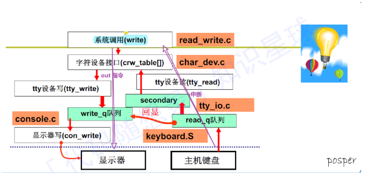

# ⽂件系统

## ⽂件

⽂件是⼀种抽象机制，它提供了⼀种在磁上保存信息⽽且⽅便以后读取的⽅法。这种⽅法可以使⽤户不必了解存储信息的⽅法、位置和实际磁盘⼯作⽅式等有关细节

### ⽂件命名

win95、win98⽤的都是MS-DOS的⽂件系统，即FAT-16， win98扩展了FAT-16成为FAT-32。
较新版的操作系统NTFS,win8配备ReFS。微软优化FAT,叫作exFAT。prog.c，圆点后⾯的部分称为⽂件扩展名。

### ⽂件结构

#### 字节结构

把⽂件看成字节序列为操作系统提供了最⼤的灵活度

#### 记录序列

⽂件结构上的第⼀步改进，这种模型中，⽂件是具有固定⻓度记录的序列

#### 树

⽂件在这种结构中由⼀棵记录树构成，每个记录不必具有相同的⻓度，记录的固定位置上有⼀个键字段。这棵树按
“键”字段进⾏排序，从⽽可以对特定“键”进⾏快速查找。

### ⽂件类型

1. 普通⽂件
2. ⽬录
3. 字符特殊⽂件（UNIX）
4. 块特殊⽂件（UNIX）

### ⽂件访问

#### 顺序访问

按顺序读取⽂件的全部字节，早期操作系统只有这种访问⽅式

#### 随机访问⽂件

当⽤磁盘存储⽂件时，可以以任何次序读取其中字节或记录的⽂件。许多应⽤程序需要这种类型⽂件

### ⽂件属性

除了⽂件名和数据外，所有操作系统还会保存其他的⽂件相关信息，如创建⽇期、时间和⼤⼩等，这些附加的信息
称为⽂件属性

举例：
创建者：创建⽂件者ID
所有者：当前所有者
当前⼤⼩：⽂件字节数
··· : ···

### ⽂件操作

使⽤⽂件的⽬的是存储信息并⽅便以后检索。对于存储和检索，不同系统提供了不同的操作。
常⻅的⽂件操作（系统调⽤）:

1. create
创建不包含任何数据的⽂件

2. delete
当不再需要某个⽂件时，必须删除该⽂件以释放磁盘空间

3. open
在使⽤⽂件之前，必须先打开⽂件

4. close
访问结束后，不再需要⽂件属性和磁盘地址，这时应该关闭⽂件以释放内部表空间

5. read
在⽂件中读取数据

6. write
向⽂件写数据，写操作⼀般也是从⽂件当前位置开始

7. append
此调⽤是write的限制形式，他只能在⽂件末尾添加数据

8. seek
对于随机访问⽂件，要指定从何处开始获取数据，通常的⽅法是⽤seek系统调⽤把当前位置指针指向⽂件中特定的位置。

9. get attributes
进程运⾏常需要读取⽂件属性

10. set attributes
某些属性是可由⽤户设置的，甚⾄在⽂件创建之后

11. rename
⽤户尝尝要改变已有的名字，rename系统调⽤⽤于这⼀⽬的

## ⽬录

⽂件系统通常提供⽬录或⽂件夹⽤于记录⽂件的位置，在很多操作系统中⽬录本身也是⽂件

### ⼀级⽬录系统

在⼀个⽬录中包含所有⽂件，这有时称为根⽬录

### 层级⽬录系统

当⽤户有着数以千计的⽂件，为了寻找⽅便。需要层次结构（即⼀个⽬录树）

### 路径名

#### 绝对路径名

它由从根⽬录到⽂件的路径组成。
Windows ： `\usr\ast\maibox`
UNIX ： `/usr/ast/mailbox`
路径名的第⼀个字符是分隔符，则这个路径是绝对路径

#### 相对路径名

它常和⼯作⽬录(working directory)(也和当前⽬录(acurrent directory))⼀起使⽤
例：UNIX

```s
cp /usr/ast/mailbox /usr/ast/mailbox/mailbox.bak
```

和命令

```s
cp mailbox mailbox.bak # 具有相同的含义
```

#### 特殊⽬录项

`. dot`：指当前⽬录
`.. dotdot`： 指其⽗⽬录

eg:

```cpp
cp ../lib/dictionay .
```

将usr/lib/下的dictionay复制到当前⽬录下

### ⽬录操作

管理⽬录的系统调⽤
举例(Unix):

```s
create # 创建⽬录
delete # 删除⽬录
opendir # ⽬录内容可被读取
closedir # 读⽬录结束
readdir # 返回打开⽬录下⼀个⽬录项
rename # 改变⽬录名
link # 链接技术允许在多个⽬录中出现同⼀个⽂件
unlink # 删除⽬录项
```

## ⽂件系统的实现

⽂件存储实现的关键问题是记录各个⽂件分别⽤到哪些磁盘块。不同的操作系统⽤到不同的⽅法

### ⽂件系统布局

⽂件系统存放在磁盘上。多数磁盘划分为⼀个或多个分区，每个分区中国有⼀个独⽴的⽂件系统。
磁盘0号扇区称为主引导记录(MBR)，⽤来引导计算机。在MBR结尾是分区表。该表给出每个分区的起始结束地址。
表中的⼀个分区被标记为活动区。在计算机被引导时，BIOS读⼊并执⾏MBR。MBR做的第⼀件事是确定活动分区，读⼊它的第⼀个块，称为引导块，并执⾏之。
引导块中的程序将装载该分区中的操作系统。

### ⽂件的实现

#### 连续分配

最简单的分配是把每个⽂件作为⼀连串连续数据块存储在磁盘
优势：
（1）实现简单
记录每个⽂件⽤到磁盘块简化为只需记住两个数字即可：第⼀块的磁盘地址和⽂件的块数。给定了第⼀块编号，⼀个简单的加法就可以找到任何其他块的编号
（2）操作性能较好
因为单个操作中就能从磁盘上读出整个⽂件。只需⼀次寻找。

#### 链表分配

为每个⽂件构造磁盘块链表。每⼀块的第⼀个字作为指向下⼀块的指针，块的其他部分存放数据。

优势：
（1）可以充分利⽤磁盘块，不会因为磁盘碎⽚浪费存储内存
（2）随机访问快。
缺点：
指针占⽤⼀些字节，每个磁盘块存储数据的字节数不再是2的整数次幂。怪异的⼤⼩降低了系统的运⾏效率，每个块前⼏个字节被指向下⼀个块的指针所占据，需要从两个磁盘中获取拼接信息，这就因复制⽽引发额外的开销。

#### 采⽤内存中的表进⾏链表分配

取出每个磁盘块的指针字，把他放在内存的⼀个表中，解决链表分配的不⾜。内存中这样的表格称为⽂件分配表(File Allocation Table，FAT)

#### i节点

最后⼀个记录各⽂件分别包含哪些磁盘块的⽅法是给每个⽂件赋予⼀个称为i节点的数据结构，其中列出了⽂件属性和⽂件的磁盘地址。

### ⽬录的实现

在读⽂件之前，必须先打开⽂件。打开⽂件时，操作系统利⽤⽤户给出的路径名找到相应的⽬录项。
简单⽬录：包含固定⼤⼩的⽬录，在⽬录项中有磁盘地址和属性采⽤i节点的系统：把⽂件属性存放在i节点中⽽不是⽬录项中。这种情形下，⽬录项会更短。

### 共享⽂件

当⼏个⽤户同在⼀个项⽬⾥⼯作时，他们常常需要共享⽂件。
共享⽂件与⽬录的联系称为⼀个链接（link）。这样⽂件系统本身就是⼀个有向⽆环图（DAG），⽽不是⼀棵树。

### ⽇志结构⽂件系统

CPU运⾏速度越来越快，磁盘容量越来越⼤，价格越来越便宜（但磁盘速度并没有增快多少），同时内存容量也以指数形式增⻓。
⽽没有得到快速发展的参数是磁道的寻道时间。这些成为了⽂件系统性能的瓶颈，为了解决这⼀问题设计了全新的⽂件系统即⽇志结构⽂件系统（LFS）。
虽然是⼀个很吸引⼈的想法，由于它们和⽂件系统不匹配，该⽂件系统并没有被⼴泛应⽤。

### ⽇志⽂件系统

基本的想法是保存⼀个⽤于记录系统下⼀步将要做什么的⽇志。
这样当系统在完成他们即将完成的任务前崩溃时，重新启动后，可以通过查看⽇志，获取崩溃前计划完成的任务，并完成它们。
这样的⽂件⽇志系统，并已经被实际应⽤。微软的NTFS、Linux的 ext3和ReiserFS⽂件系统都使⽤⽇志。

### 虚拟⽂件系统

将多个⽂件系统整合到⼀个统⼀的结构中。
⼀个Linux系统可以⽤ext2作为根⽂件系统，ext3分区装载在/usr下，另⼀块采⽤ReiserFS⽂件系统的硬盘装载在/home下，以及⼀个ISO 9660的CD-ROM临时装载在/mnt下。从⽤户的观点来看，只有⼀个⽂件系统层级。
它们事实上是多种⽂件系统，对于⽤户和进程是不可⻅的。绝⼤多数Unix操作系统都在使⽤虚拟⽂件系统（VirtualFile System, VFS）

## ⽂件系统的管理和优化

### 磁盘空间管理

⼏乎所有⽂件系统都把⽂件分割成固定⼤⼩的块来存储，各块之间不⼀定相邻

#### 块⼤⼩

从历史的观点上来说，⽂件系统将⼤⼩设在1~4KB之间，但现在随着磁盘超过了1TB，还是将块的⼤⼩提升到64KB
并且接受浪费的磁盘孔空间，这样也许更好。磁盘空间⼏乎不再会短缺。

#### 记录空闲块

（1）磁盘块链表
链表的每个块中包含尽可能多的空闲磁盘块号。
通常情况下，采⽤空闲块存放空闲表，这样不会影响存储器

（2）位图
在位图中，空闲块⽤1表示，已分配块⽤0表示。

（3）磁盘配额
为防⽌⼈们贪⼼⽽占有太多的磁盘空间，⽤户操作系统常常提供⼀种强制性磁盘配额机制。
其思想是系统管理员分给每个⽤户拥有⽂件和块的最⼤数量，操作系统确保每个⽤户不超过分给他们的配额。（配额表、打开⽂件表）

### ⽂件系统备份

做磁盘备份主要是处理好两个潜在问题中的⼀个

1. 从意外的灾难中恢复
2. 从错误的操作中恢复

### ⽂件系统的⼀致性

很多⽂件系统读取磁盘块，进⾏修改后，再写回磁盘。
如果在修改过的磁盘块全部写回之前系统崩溃，则⽂件系统有可能处于不⼀致状态。
如果⼀些未被写回的块是i节点块、⽬录块或者是包含有空闲表的块时，这个问题尤为严重

### ⽂件系统性能

#### ⾼速缓存

减少磁盘访问次数技术是块⾼速缓存（block cache）或者缓冲区⾼速缓存（buffer cache）。
本书中，⾼速缓存指的是⼀系列的块，它们在逻辑上属于磁盘，但实际上基于性能的考虑被保存在内存中。

#### 块提取读

在需要⽤到块之前，试图提前将其写⼊⾼速缓存，从⽽提⾼命中率。
块提前读策略只适⽤于实际顺序读取的⽂件。对随机访问⽂件，提前读丝毫不起作⽤。

#### 减少磁盘臂运动

把可能顺序访问的块放⼀起，当然最好是同⼀柱⾯上，从⽽减少磁盘臂的移动次数。

### 磁盘碎⽚整理

移动⽂件使它们相邻，并把所有的空闲空间放在⼀个或多个⼤的连续区域内。

## 磁盘

### ⽣磁盘的使⽤

⽣磁盘：根据盘块号来使⽤磁盘；
熟磁盘：根据⽂件来使⽤磁盘。

### 磁盘如何使⽤？

1. 发送 out 指令；
2. ⽂件视图；
3. 发送 中断

### 磁盘的结构

盘⾯：类似于多个堆叠在⼀起的 DVD 光盘
磁道：每个 DVD 光盘上的同⼼圆
扇区：每个同⼼圆上的 ⼀段⼉ ⼩区域

### 磁盘 IO 过程

寻道：将磁头移动到 指定 磁道
旋转：将磁头旋转到磁道中的指定 扇区
传输：对指定扇区 进⾏ 磁盘数据 IO 读写

### ⼀层抽象

通过盘块号读写磁盘

对于⽤户来说，如果直接利⽤ 盘/柱⾯ C、磁头 H、扇区 S 来进⾏ 磁盘 IO 不太友好，所以通过⼀层抽象，即 ⽤户只⽤利⽤ 盘块号 block 来进⾏ 磁盘IO，然后由系统根据 block 计算出 C、H、S 即可

### 磁盘编址

由于寻道时间 通常时间更⻓⼀些，所以，为了让 磁盘 IO 时间尽可能短⼀些，则需要使 寻道时间尽量段。即，把当⼀个 磁道编址⽤完后，向下⼀个 柱⾯ 继续编号，⽽不是向 下⼀个 磁道继续编号。


### ⼆层抽象

多个进程通过队列使⽤磁盘
虽然⼀层抽象（利⽤ 盘块号）可以达到使⽤磁盘的⽬的，但是如果有多个磁盘访问请求出现在请求队列怎么办?此时，操作系统会根据**磁盘调度算法**来挑选⼀个**磁盘请求服务**

### 常⻅磁盘调度算法

#### FCFS：找最先来的请求

优点：公平
缺点：并不提供 最快的服务
FCFS 在寻道过程中，可能已经遇到⼀些以后可能需要访问的 磁道，但是会跳过，⽽造成 访问磁道 耗费时间较多。

#### SSTF：类似于 SJF，每次选择距离当前磁头最近的待处理请求

优点：寻道时间最短
缺点：可能造成部分请求 “饥饿”（当某个请求的磁盘距离磁头较远，⽽⼀直有⽐其更近的请求时，这个请求⼀直⽆
法执⾏）

#### SCAN 算法：类似电梯，先处理向上的请求，然后再处理反⽅向的请求

优点：不会造成部分请求的 “饥饿”


### 三层抽象

利⽤⽂件使⽤磁盘，就成了熟磁盘
让普通⽤户使⽤ raw disk： 许多⼈连扇区都不知道是什么? 要求他们根据盘块号来访问磁盘不太便利需要在盘块上引⼊更⾼⼀层次的抽象概念! ⽂件

⽤户眼⾥的 “⽂件”：⼀堆字符序列（字符流）
磁盘上的 “⽂件”：多个盘块构成的集合

所以，如果要利⽤⽂件来进⾏磁盘IO的话，就需要建⽴字符流到盘块集合的映射关系

常⻅的⽂件映射关系（⽂件实现⽅式）有以下 3 种：

1. 顺序结构
2. 链式结构
3. 索引
顺序结构-实现⽂件

FCB：**记录⽂件在磁盘中的起始块**

### ⽂件->盘块号

如何根据 ⽂件 找到 盘块号？
将⽂件按照 连续结构存放；（下 左图）；
对每个⽂件建⽴⼀个 FCB，记录该⽂件在磁盘中的 起始块号；
根据⽂件（字符流）中的第 n 个待查字符 + FCB 计算 （n / 每个盘块的⼤⼩ + FCB中的 起始块号】出其在磁盘上对
应的 盘块号 [得到盘块号，然后采⽤ SCAN 算法]
这种⽅法的缺点：

1. 利⽤顺序结构存储⽂件，不利⽤⽂件的修改（因为 顺序存储的 增/删 代价⾮常⼤）
2. 所以，当需要 动态修改 ⽂件时，最好使⽤ 链式存储⽂件


链式结构-实现⽂件
优点：利于 增/删
缺点：不利于查询

## 外设管理

### 如何让外设动起来

1. CPU 向 外设的控制器发送指令，即 out 指令
2. 形成 ⽂件视图（为了统⼀ out 指令的形式）
3. 中断（外设处理完事后，需要通知 cpu 继续接⼿ 下⼀步处理）


显示器如何⼯作？即，printf 函数的⼯作流程


### 键盘如何⼯作？

中断处理（根据扫描码 获取 对应的 ascii 码）；
将对应的 ascii 码 加⼊ 缓冲队列 read_que 中，等待上层程序调⽤


