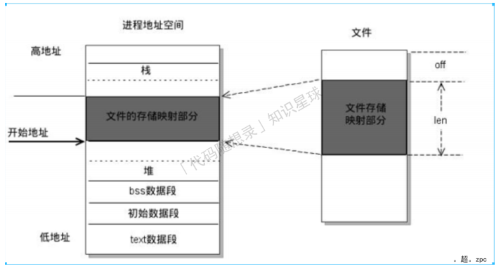

# 操作系统

## 进程通信(实现)

### 共享存储映射

存储映射I/O (Memory-mapped I/O) 使⼀个磁盘⽂件与存储空间中的⼀个缓冲区相映射.
于是当从缓冲区中取数据，就相当于读⽂件中的相应字节。于此类似，将数据存⼊缓冲区，则相应的字节就⾃动写
⼊⽂件。
这样，就可在不适⽤read和write函数的情况下，使⽤地址（指针）完成I/O操作，进程就可以直接通过读写内存来
操作⽂件.
共享内存可以说是最有⽤的进程间通信⽅式，也是最快的IPC形式, 因为进程可以直接读写内存，⽽不需要任何数据
的拷⻉.



#### 存储映射函数

##### mmap函数

```cpp
#include <sys/mman.h>
/**
* ⼀个⽂件或者其它对象映射进内存.
* @param addr 指定映射的起始地址, 通常设为NULL, 由系统指定.
* @param length 映射到内存的⽂件⻓度.
* @param prot 映射区的保护⽅式, 最常⽤的:
* (1) 读：PROT_READ;
* (2) 写：PROT_WRITE;
* (3) 读写：PROT_READ | PROT_WRITE.
* @param flags 映射区的特性, 可以是:
* (1) MAP_SHARED: 写⼊映射区的数据会复制回⽂件,
* 且允许其他映射该⽂件的进程共享。
* (2) MAP_PRIVATE: 对映射区的写⼊操作
* 会产⽣⼀个映射区的复制(copy - on - write),
* 对此区域所做的修改不会写回原⽂件。
* @param fd 由open返回的⽂件描述符, 代表要映射的⽂件.
* @param offset 以⽂件开始处的偏移量,
* 必须是4k的整数倍, 通常为0, 表示从⽂件头开始映射.
* @return 成功：返回创建的映射区⾸地址; 失败：MAP_FAILED宏.
*/
void *mmap(void *addr, size_t length,
int prot, int flags, int fd, off_t offset);
```

>内存是按照⻚来区别的，通常⼀⻚就是4K

总结：

1. 第⼀个参数写成NULL
2. 第⼆个参数要映射的⽂件⼤⼩ > 0
3. 第三个参数：PROT_READ 、PROT_WRITE
4. 第四个参数：MAP_SHARED 或者 MAP_PRIVATE
5. 第五个参数：打开的⽂件对应的⽂件描述符
6. 第六个参数：4k的整数倍，通常为0

##### munmap函数

```cpp
#include <sys/mman.h>
/**
* 释放内存映射区.
* @param addr 使⽤mmap函数创建的映射区的⾸地址.
* @param length 映射区的⼤⼩.
* @return 成功返回0; 失败返回-1.
*/
int munmap(void *addr, size_t length);
```

#### 注意事项

1. 创建映射区的过程中，隐含着⼀次对映射⽂件的读操作
2. 当MAP_SHARED时，要求：映射区的权限应 <=⽂件打开的权限(出于对映射区的保护)。⽽MAP_PRIVATE则⽆所谓，因为mmap中的权限是对内存的限制
3. 映射区的释放与⽂件关闭⽆关。只要映射建⽴成功，⽂件可以⽴即关闭
4. 特别注意，当映射⽂件⼤⼩为0时，不能创建映射区。所以，⽤于映射的⽂件必须要有实际⼤⼩。mmap使⽤时常常会出现总线错误，通常是由于共享⽂件存储空间⼤⼩引起的
5. munmap传⼊的地址⼀定是mmap的返回地址。坚决杜绝指针++操作
6. 如果⽂件偏移量必须为4K的整数倍
7. mmap创建映射区出错概率⾮常⾼，⼀定要检查返回值，确保映射区建⽴成功再进⾏后续操作

#### 匿名映射实现⽗⼦进⾏通信

（1）为什么使⽤匿名的⽅式实现通信？
内存映射的需要依赖⽂件。⽽建⽴⽂件建⽴好了只会还要unlink close掉，⽐较麻烦;
（2）有什么好的不能办法进⾏解决？
直接使⽤匿名映射来代替;
（3）Linux系统给我们提供了创建匿名映射区的⽅法，⽆需依赖⼀个⽂件即可创建映射区。同样需要借助标志位参数flags来指定;
（4）使⽤MAP_ANONYMOUS (或MAP_ANON):

```cpp
int *p = mmap(NULL, 4, PROT_READ|PROT_WRITE, MAP_SHARED|MAP_ANONYMOUS, -1, 0);
```

### 消息队列

基本原理：A 进程要给 B 进程发送消息，A 进程把数据放在对应的消息队列后就可以正常返回了，B 进程需要的时
候再去读取数据就可以了。

特点：

1. 消息队列是保存在内核中的消息链表，每个消息体都是固定⼤⼩的存储块。如果进程从消息队列中读取了消息
体，内核就会把这个消息体删除。
2. 如果没有释放消息队列或者没有关闭操作系统，消息队列会⼀直存在。

缺点：

1. 通信不及时，附件也有⼤⼩限制。
2. 消息队列不适合⽐较⼤数据的传输，每个消息体都有⼀个最⼤⻓度的限制，同时所有队列所包含的全部消息体的总⻓度也是有上限
3. 消息队列通信过程中，存在⽤户态与内核态之间的数据拷⻉开销

### 信号

信号是linux进程通信的最古⽼的⽅式
信号是软件中断，它是在软件层次上对中断机制的⼀种模拟，是⼀种异步通信的⽅式 。信号可以导致⼀个正在运⾏的进程被另⼀个正在运⾏的异步进程中断，转⽽处理某⼀个突发事件
信号可以直接进⾏⽤户空间进程和内核空间进程的交互，内核进程可以利⽤它来通知⽤户空间进程发⽣了哪些系统事件

#### 信号的特点

1. 简单
2. 不能携带⼤量信息
3. 满⾜某个特定条件才发送

#### ⼀个完整的信号周期

1. 信号的产⽣
2. 信号在进程种的注册，信号在进程种的注销
3. 执⾏信号处理函数

#### 信号编号

（1）不存在编号为0的信号

1. 其中1-31号信号称之为常规信号（也叫普通信号或标准信号）
2. 34-64称之为实时信号，驱动编程与硬件相关。名字上区别不⼤。⽽前32个名字各不相同

（2）不存在编号为0的号，也没有32-33号

（3）⽐较重要的⼀些，需要记住的⼏个信号

1. SIGINT 当⽤户按下了<Ctrl+C>组合键时，⽤户终端向正在运⾏中的由该终端启动的程序发出此信号，终⽌进程
2. SIGQUIT ⽤户按下<ctrl+>组合键时产⽣该信号，⽤户终端向正在运⾏中的由该终端启动的程序发出些信号,终⽌进程
3. SIGSEGV 指示进程进⾏了⽆效内存访问(段错误), 终⽌进程并产⽣core⽂件
4. SIGPIPE Broken pipe向⼀个没有读端的管道写数据,终⽌进程
5. SIGCHLD ⼦进程结束时，⽗进程会收到这个信号,忽略这个信号

#### 信号四要素

1. 编号: man 7 signal 查看⽂档帮助
2. 名称
3. 事件
4. 默认处理动作:
   1. Term：终⽌进程
   2. Ign： 忽略信号 (默认即时对该种信号忽略操作)
   3. Core：终⽌进程，⽣成Core⽂件。(查验死亡原因，⽤于gdb调试)
   4. Stop：停⽌（暂停）进程
   5. Cont：继续运⾏进程

特别强调: SIGKILL 和 SIGSTOP信号，不允许忽略和捕捉，只能执⾏默认动作。甚⾄不能将其设置为阻塞.

#### 信号的状态

1. 产⽣
   1. 当⽤户按某些终端键时，将产⽣信号
   2. 硬件异常将产⽣信号
   3. 软件异常将产⽣信号
   4. 调⽤系统函数(如：kill、raise、abort)将发送信号
   5. 运⾏ kill /killall命令将发送信号
2. 未决状态：没有被处理
3. 递达状态：信号被处理了

#### 阻塞信号集和未决信号集

##### 阻塞信号集

将某些信号加⼊集合，对他们设置屏蔽，当屏蔽x信号后，再收到该信号，该信号的处理将推后(处理发⽣在解除屏
蔽后)

##### 未决信号集合

信号产⽣，未决信号集中描述该信号的位⽴刻翻转为1，表示信号处于未决状态。当信号被处理对应位翻转回为0。
这⼀时刻往往⾮常短暂

#### 信号产⽣函数

##### kill函数

```cpp
#include <sys/types.h>
#include <signal.h>
/**
* 给指定进程发送指定信号(不⼀定杀死).
* @param pid 取值有四种情况：
* pid > 0: 将信号传送给进程 ID 为pid的进程.
* pid = 0 : 将信号传送给当前进程所在进程组中的所有进程.
* pid = -1 : 将信号传送给系统内所有的进程.
* pid < -1 : 将信号传给指定进程组的所有进程，这个进程组号等于 pid 的绝对值.
* @param sig 信号的编号，这⾥可以填数字编号，也可以填信号的宏定义.
* 可以通过命令 kill - l("l" 为字⺟)进⾏相应查看.
* 不推荐直接使⽤数字，应使⽤宏名，因为不同操作系统信号编号可能不同，但名称⼀致.
* @return 成功: 0; 失败: -1.
* 普通⽤户基本规则是：发送者实际或有效⽤户ID == 接收者实际或有效⽤户ID.
*/
int kill(pid_t pid, int sig);
```

##### raise函数

```cpp
#include <signal.h>
/**
* 给当前进程发送指定信号(⾃⼰给⾃⼰发)，等价于 kill(getpid(), sig).
* @param sig 信号编号.
* @return 成功: 0; 失败: ⾮0值.
*/
int raise(int sig);
```

##### abort函数

```cpp
#include <stdlib.h>
/**
* 给⾃⼰发送异常终⽌信号 6) SIGABRT，并产⽣core⽂件，等价于kill(getpid(), SIGABRT).
*/
void abort(void);
```

##### alarm函数(闹钟)

```cpp
#include <unistd.h>
/**
* 设置定时器(闹钟)。在指定seconds后，内核会给当前进程发送14）SIGALRM信号。进程收到该信号，默认动作终
⽌。每个进程都有且只有唯⼀的⼀个定时器;
* 取消定时器alarm(0)，返回旧闹钟余下秒数.
* @param seconds 指定的时间，以秒为单位.
* @return 返回0或剩余的秒数.
* /
unsigned int alarm(unsigned int seconds);
```

##### setitimer函数（定时器）

```cpp
#include <sys/time.h>
struct itimerval {
 struct timerval it_interval; // 闹钟触发周期
 struct timerval it_value; // 闹钟触发时间
};
struct timeval {
 long tv_sec; // 秒
 long tv_usec; // 微秒
}
/**
* 设置定时器(闹钟)。 可代替alarm函数。精度微秒us，可以实现周期定时.
* @param which 指定定时⽅式:
* (1) ⾃然定时：ITIMER_REAL → 14）SIGALRM计算⾃然时间;
* (2) 虚拟空间计时(⽤户空间)：ITIMER_VIRTUAL → 26）SIGVTALRM 只计算进程占⽤cpu
的时间;
* (3) 虚拟空间计时(⽤户空间)：ITIMER_VIRTUAL → 26）SIGVTALRM 只计算进程占⽤cpu
的时间.
* @param new_value 负责设定timeout时间.
* @param old_value 存放旧的timeout值，⼀般指定为NULL.
* @return 成功: 0; 失败: -1.
*/
int setitimer(int which, const struct itimerval *new_value, struct itimerval
*old_value);
// itimerval.it_value： 设定第⼀次执⾏function所延迟的秒数
// itimerval.it_interval： 设定以后每⼏秒执⾏function
```

#### ⾃定义信号集函数

```cpp
#include <signal.h> 
int sigemptyset(sigset_t *set); // 将set集合置空
int sigfillset(sigset_t *set); // 将所有信号加⼊set集合
int sigaddset(sigset_t *set, int signo); // 将signo信号加⼊到set集合
int sigdelset(sigset_t *set, int signo); // 从set集合中移除signo信号
int sigismember(const sigset_t *set, int signo); // 判断信号是否存在
```

除sigismember外，其余操作函数中的set均为传出参数。sigset_t类型的本质是位图;

#### 阻塞信号集

（1）信号阻塞集也称信号屏蔽集、信号掩码;
（2）信号阻塞集⽤来描述哪些信号递送到该进程的时候被阻塞;
（3）sigprocmask函数

```cpp
#include <signal.h>
/**
* 检查或修改信号阻塞集，根据 how 指定的⽅法对进程的阻塞集合进⾏修改，
* 新的信号阻塞集由 set 指定，⽽原先的信号阻塞集合由 oldset 保存.
*
* @param how 信号阻塞集合的修改⽅法，有 3 种情况:
* (1) SIG_BLOCK：向信号阻塞集合中添加 set 信号集，
* 新的信号掩码是set和旧信号掩码的并集。相当于 mask = mask|set;
* (2) SIG_UNBLOCK：从信号阻塞集合中删除 set 信号集，
* 从当前信号掩码中去除 set 中的信号。相当于 mask = mask & ~ set;
* (3) SIG_SETMASK：将信号阻塞集合设为 set 信号集，
* 相当于原来信号阻塞集的内容清空，然后按照 set 中的信号重新设置信号阻塞集。相当于
mask = set.
*
* @set 要操作的信号集地址,若 set 为 NULL，则不改变信号阻塞集合，函数只把当前信号阻塞集合保存到
oldset 中.
* @oldset 保存原先信号阻塞集地址.
* @return 成功: 0; 失败: -1，失败时错误代码只可能是 EINVAL，表示参数 how 不合法.
*/
int sigprocmask(int how, const sigset_t *set, sigset_t *oldset);
```

（4）sigpending函数

```cpp
#include <signal.h>
/**
* 读取当前进程的未决信号集.
* @param set 未决信号集.
* @return 成功: 0; 失败: -1.
*/
int sigpending(sigset_t *set);
```

#### 信号捕捉

>注意: SIGKILL 和 SIGSTOP 不能更改信号的处理⽅式，因为它们向⽤户提供了⼀种使进程终⽌的可靠⽅法;

（1）sigaction函数

```cpp
#include <signal.h>
/**
* 检查或修改指定信号的设置（或同时执⾏这两种操作）.
* @param signum 要操作的信号.
* @param act 要设置的对信号的新处理⽅式（传⼊参数）.
* @param oldact：原来对信号的处理⽅式（传出参数）.
*
* 如果 act 指针⾮空，则要改变指定信号的处理⽅式（设置），
* 如果 oldact 指针⾮空，则系统将此前指定信号的处理⽅式存⼊ oldact.
*
* @return 成功: 0; 失败: -1.
*/
int sigaction(int signum, const struct sigaction *act, struct sigaction *oldact);
```

（2）sa_handler、sa_sigaction：信号处理函数指针

和 signal() ⾥的函数指针⽤法⼀样，应根据情况给sa_sigaction、sa_handler 两者之⼀赋值，其取值如下：

1. SIG_IGN：忽略该信号
2. SIG_DFL：执⾏系统默认动作
3. 处理函数名：⾃定义信号处理函数

（3）sa_mask：
信号阻塞集，在信号处理函数执⾏过程中，临时屏蔽指定的信号;

（4）sa_flags：
⽤于指定信号处理的⾏为，通常设置为0，表使⽤默认属性。它可以是⼀下值的“按位或”组合：

1. A_RESTART：使被信号打断的系统调⽤⾃动重新发起（已经废弃）
2. SA_NOCLDSTOP：使⽗进程在它的⼦进程暂停或继续运⾏时不会收到 SIGCHLD 信号
3. SA_NOCLDWAIT：使⽗进程在它的⼦进程退出时不会收到 SIGCHLD 信号，这时⼦进程如果退出也不会成为僵⼫进程
4. SA_NODEFER：使对信号的屏蔽⽆效，即在信号处理函数执⾏期间仍能发出这个信号
5. SA_RESETHAND：信号处理之后重新设置为默认的处理⽅式
6. SA_SIGINFO：使⽤ sa_sigaction 成员⽽不是 sa_handler 作为信号处理函数

#### struct sigaction结构体

```cpp
struct sigaction {
    void(*sa_handler)(int); //旧的信号处理函数指针
    void(*sa_sigaction)(int, siginfo_t *, void *); //新的信号处理函数指针
    sigset_t sa_mask; //信号阻塞集
    int sa_flags; //信号处理的⽅式
    void(*sa_restorer)(void); //已弃⽤
};
```

#### 信号处理函数

```cpp
/**
* @param signum 信号的编号.
* @param info 记录信号发送进程信息的结构体.
* @param context 可以赋给指向 ucontext_t 类型的⼀个对象的指针
* 以引⽤在传递信号时被中断的接收进程或线程的上下⽂.
*/
void(*sa_sigaction)(int signum, siginfo_t *info, void *context);
```

#### 不可重⼊、可重⼊函数

如果有⼀个函数不幸被设计成为这样：那么不同任务调⽤这个函数时可能修改其他任务调⽤这个函数的数据，从⽽导致不可预料的后果。
这样的函数是不安全的函数，也叫不可重⼊函数;

（1）不可重⼊函数:

1. 函数体内使⽤了静态的数据结构;
2. 函数体内调⽤了malloc() 或者 free() 函数(谨慎使⽤堆);
3. 函数体内调⽤了标准 I/O 函数;

（2）可重⼊函数:

1. 所谓可重⼊是指⼀个可以被多个任务调⽤的过程，任务在调⽤时不必担⼼数据是否会出错;
2. 在写函数时候尽量使⽤局部变量（例如寄存器、栈中的变量）;
3. 对于要使⽤的全局变量要加以保护（如采取关中断、信号量等互斥⽅法），这样构成的函数就⼀定是⼀个可重⼊的函数.

#### SIGCHLD信号

1. ⼦进程终⽌时;
2. ⼦进程接收到SIGSTOP信号停⽌时;
3. ⼦进程处在停⽌态，接受到SIGCONT后唤醒时。

#### 如何避免僵⼫进程

（1）最简单的⽅法:
⽗进程通过 wait() 和 waitpid() 等函数等待⼦进程结束，但是，这会导致⽗进程挂起;
（2）如果⽗进程要处理的事情很多，不能够挂起，通过 signal() 函数⼈为处理信号 SIGCHLD:
只要有⼦进程退出⾃动调⽤指定好的回调函数，因为⼦进程结束后， ⽗进程会收到该信号 SIGCHLD ，可以在其回调函数⾥调⽤ wait() 或 waitpid() 回收;
（3）如果⽗进程不关⼼⼦进程什么时候结束，那么可以⽤signal（SIGCHLD, SIG_IGN）通知内核:
⾃⼰对⼦进程的结束不感兴趣，⽗进程忽略此信号，那么⼦进程结束后，内核会回收，并不再给⽗进程发送信号;

### 守护进程

1. 进程组概述
   1. 代表⼀个或多个进程的集合;
   2. 每个进程都属于⼀个进程组;
   3. 是为了简化对多个进程的管理。

2. 会话
   1. ⼀个会话可以有⼀个控制终端。这通常是终端设备或伪终端设备;
   2. 建⽴与控制终端连接的会话⾸进程被称为控制进程;
   3. ⼀个会话中的⼏个进程组可被分为⼀个前台进程组以及⼀个或多个后台进程组;
   4. 如果⼀个会话有⼀个控制终端，则它有⼀个前台进程组，其它进程组为后台进程组;
   5. 如果终端接⼝检测到断开连接，则将挂断信号发送⾄控制进程（会话⾸进程。

3. 创建会话注意事项
   1. 调⽤进程不能是进程组组⻓，该进程变成新会话⾸进程(session header);
   2. 该调⽤进程是组⻓进程，则出错返回;
   3. 该进程成为⼀个新进程组的组⻓进程;
   4. 需有root权限(ubuntu不需要);
   5. 新会话丢弃原有的控制终端，该会话没有控制终端;
   6. 建⽴新会话时，先调⽤fork, ⽗进程终⽌，⼦进程调⽤setsid。

4. API函数
   1. getsid 函数

        ```cpp
        #include <unistd.h>
        /**
        * 获取进程所属的会话ID.
        * @param pid 进程号，pid为0表示查看当前进程session ID.
        * @return 成功: 返回调⽤进程的会话ID; 失败: -1.
        */
        pid_t getsid(pid_t pid);
        ```

   2. setsid函数

        ```cpp
        #include <unistd.h>
        /**
        * 创建⼀个会话，并以⾃⼰的ID设置进程组ID，同时也是新会话的ID。
        * 调⽤了setsid函数的进程，既是新的会⻓，也是新的组⻓.
        *
        * @return 成功： 返回调⽤进程的会话ID; 失败: -1.
        */
        pid_t setsid(void);
        ```

5. 守护进程
守护进程（Daemon Process），也就是通常说的 Daemon 进程（精灵进程），是 Linux 中的后台服务进程
   1. 它是⼀个⽣存期较⻓的进程，通常独⽴于控制终端并且周期性地执⾏某种任务或等待处理某些发⽣的事件
   2. ⼀般采⽤以d结尾的名字
   3. 所有的服务存在于 etc/init.d
   4. 守护进程是个特殊的孤⼉进程
   5. 之所以脱离于终端是为了避免进程被任何终端所产⽣的信息所打断，其在执⾏过程中的信息也不在任何终端上显示 
   6. Linux 的⼤多数服务器就是⽤守护进程实现的

6. 守护进程模型
   1. 创建⼦进程，⽗进程退出(必须)
    所有⼯作在⼦进程中进⾏形式上脱离了控制终端
   2. 在⼦进程中创建新会话(必须)
      1. setsid()函数
      2. 使⼦进程完全独⽴出来，脱离控制
   3. 改变当前⽬录为根⽬录(不是必须)
      1. chdir()函数
      2. 防⽌占⽤可卸载的⽂件系统
      3. 也可以换成其它路径
   4. 重设⽂件权限掩码(不是必须)
      1. umask()函数
      2. 防⽌继承的⽂件创建屏蔽字拒绝某些权限
      3. 增加守护进程灵活性
   5. 关闭⽂件描述符(不是必须)
    继承的打开⽂件不会⽤到，浪费系统资源，⽆法卸载
   6. 开始执⾏守护进程核⼼⼯作(必须)
    守护进程退出处理程序模型
